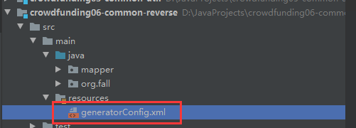
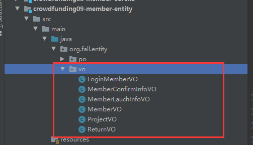
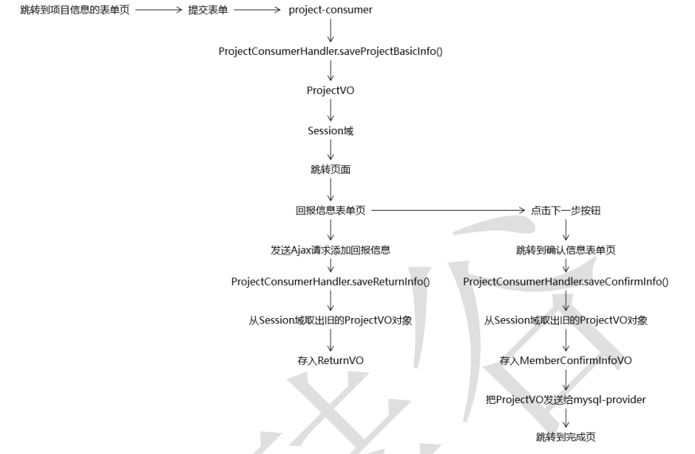
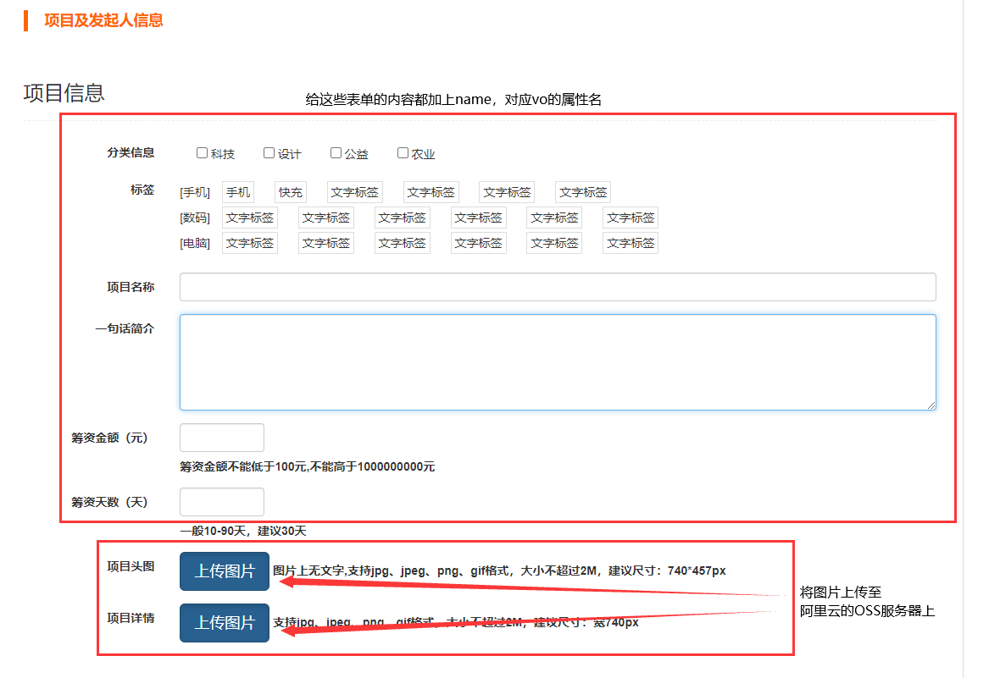
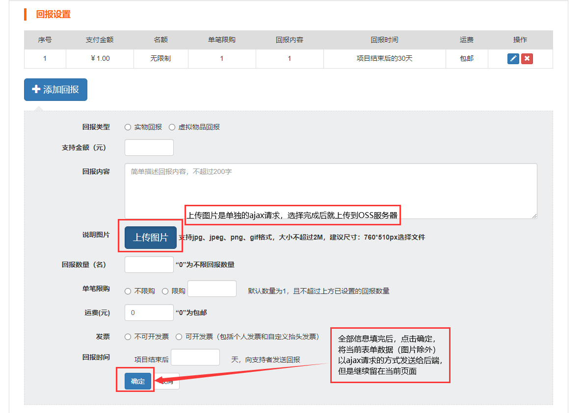

# 一、“发起项目” 建模

## 1、创建数据库表

```sql
# 分类表
CREATE TABLE t_type (
	id INT ( 11 ) NOT NULL auto_increment,
	name VARCHAR ( 255 ) COMMENT '分类名称',
	remark VARCHAR ( 255 ) COMMENT '分类介绍',
	PRIMARY KEY ( id ) 
);

# 项目分类中间表
create table t_project_type (
	id	int not null auto_increment,
	projectid	int(11),
	typeid	int(11),
	primary key (id)
);

# 标签表
create table t_tag
(	
	id	int(11) not null auto_increment,
	pid	int(11),
	name	varchar(255),
	primary key (id)
);

# 项目标签中间表
create table t_project_tag
(
	id	int(11) not null auto_increment,
	projectid	int(11),
	tagid	int(11),
	primary key (id)	
);	

# 项目表
create table t_project	
(	
	id	int(11) not null auto_increment,
	project_name	varchar(255) comment '项目名称',
	project_description	varchar(255) comment '项目描述',
	money	bigint (11) comment '筹集金额',
	day	int(11) comment '筹集天数',
	status	int(4) comment '0-即将开始，1-众筹中，2-众筹成功，3-众筹失败',	
	deploydate	varchar(10) comment '项目发起时间',
	supportmoney	bigint(11) comment '已筹集到的金额',
	supporter	int(11) comment '支持人数',
	completion	int(3) comment '百分比完成度',
	memberid	int(11) comment '发起人的会员 id',
	createdate	varchar(19) comment '项目创建时间',
	follower	int(11) comment '关注人数',
	header_picture_path	varchar(255) comment '头图路径',
	primary key (id)	
);	

# 项目表项目详情图片表中间表
create table t_project_item_pic
(
	id	int(11) not null auto_increment,
	projectid	int(11),
	item_pic_path	varchar(255),
	primary key (id)
);

# 项目发起人信息表
create table t_member_launch_info
(		
	id	int(11) not null auto_increment,
	memberid	int(11)	comment '会员 id',
	description_simple   varchar(255)   comment '简单介绍',
	description_detail   varchar(255)   comment '详细介绍',
	phone_num	varchar(255)   comment '联系电话',
	service_num	varchar(255)	comment '客服电话',
	primary key (id)		
);		

# 回报信息表
create table t_return		
(		
	id	int(11) not null auto_increment,
	projectid	int(11),	
	type	int(4) comment '0 - 实物回报， 1 虚拟物品回报',
	supportmoney	int(11) comment '支持金额',
	content	varchar(255) comment '回报内容',
	count	int(11) comment '回报产品限额，“0”为不限回报数量',
	signalpurchase	int(11) comment '是否设置单笔限购',
	purchase	int(11) comment '具体限购数量',
	freight	int(11) comment '运费，“0”为包邮',
	invoice	int(4) comment '0 - 不开发票， 1 - 开发票',
	returndate	int(11) comment '项目结束后多少天向支持者发送回报',
	describ_pic_path	varchar(255) comment '说明图片路径',
	primary key (id)		
);		

# 发起人确认信息表
create table t_member_confirm_info	
(		
	id	int(11) not null auto_increment,
	memberid	int(11) comment '会员 id',
	paynum	varchar(200) comment '易付宝企业账号',
	cardnum	varchar(200) comment '法人身份证号',
	primary key (id)		
);		
```

## 2、逆向工程



```xml
<?xml version="1.0" encoding="UTF-8"?>
<!DOCTYPE generatorConfiguration
        PUBLIC "-//mybatis.org//DTD MyBatis Generator Configuration 1.0//EN"
        "http://mybatis.org/dtd/mybatis-generator-config_1_0.dtd">

<generatorConfiguration>
    <context id="atguiguTables" targetRuntime="MyBatis3">
        <commentGenerator>
            <!-- 是否去除自动生成的注释 true：是 ： false:否 -->
            <property name="suppressAllComments" value="true" />
        </commentGenerator>

        <!-- 数据库链接URL、用户名、密码 -->
        <jdbcConnection
                driverClass="com.mysql.cj.jdbc.Driver"
                connectionURL="jdbc:mysql://localhost:3306/project_rowd?serverTimezone=UTC"
                userId="root"
                password="root">
        </jdbcConnection>

        <!--
        默认false，把JDBC DECIMAL 和 NUMERIC 类型解析为 Integer
            true，把JDBC DECIMAL 和 NUMERIC 类型解析为java.math.BigDecimal
        -->
        <javaTypeResolver>
            <property name="forceBigDecimals" value="false" />
        </javaTypeResolver>

        <!--
        生成model模型，对应的包路径，以及文件存放路径(targetProject)，targetProject可以指定具体的路径,如./src/main/java，
        也可以使用“MAVEN”来自动生成，这样生成的代码会在target/generatord-source目录下
        -->
        <!--<javaModelGenerator targetPackage="com.joey.mybaties.test.pojo" targetProject="MAVEN">-->
        <javaModelGenerator targetPackage="org.fall.entity.po" targetProject=".\src\main\java">
            <!--是否让schema作为包的后缀-->
            <property name="enableSubPackages" value="false"/>
            <!-- 从数据库返回的值被清理前后的空格  -->
            <property name="trimStrings" value="true" />
        </javaModelGenerator>

        <!--对应的mapper.xml文件  -->
        <sqlMapGenerator targetPackage="mapper" targetProject=".\src\main\java">
            <!--是否让schema作为包的后缀-->
            <property name="enableSubPackages" value="false"/>
        </sqlMapGenerator>

        <!-- 对应的Mapper接口类文件 -->
        <javaClientGenerator type="XMLMAPPER" targetPackage="org.fall.mapper" targetProject=".\src\main\java">
            <!--是否让schema作为包的后缀-->
            <property name="enableSubPackages" value="false"/>
        </javaClientGenerator>


        <!-- 数据库表名与需要的实体类对应映射的指定 -->
        <table tableName="t_type" domainObjectName="TypePO" />
        <table tableName="t_tag" domainObjectName="TagPO" />
        <table tableName="t_project" domainObjectName="ProjectPO" />
        <table tableName="t_project_item_pic" domainObjectName="ProjectItemPicPO" />
        <table tableName="t_member_launch_info" domainObjectName="MemberLaunchInfoPO" />
        <table tableName="t_return" domainObjectName="ReturnPO" />
        <table tableName="t_member_confirm_info" domainObjectName="MemberConfirmInfoPO" />

    </context>
</generatorConfiguration>
```

通过MAVEN工具生成实体类、mapper接口即mapper文件，并放入对应的各个目录。

## 3、创建与浏览器对应的VO对象



详细内容见代码，与浏览器发来的数据相对应。


# 二、“发起项目”功能实现

**总目标：**把各个前端表单的数据汇总到一起，并存入各个数据库表中。

**思路：**




项目部分的页面与代码主要在**crowdfunding13-member-project-consumer**模块完成


## 项目发起部分

### 1、跳转到众筹页面

**Zuul模块**的配置文件application.yml中增加project模块的访问路径

```yml
zuul:
  ignored-services: "*"       # 表示忽视直接通过application-name访问微服务，必须通过route
  sensitive-headers: "*"      # 在Zuul向其他微服务重定向时，保持原本的头信息（请求头、响应头）
  routes:                     # 指定网关路由
    crowd-protal:
      service-id: crowd-auth  # 对应application-name
      path: /**               # 表示直接通过根路径访问，必须加上**，否则多层路径无法访问
    crowd-project:
      service-id: crowd-project
      path: /project/**
```

**project模块**的配置文件先进行基础的配置：

```yml
server:
  port: 5000
spring:
  application:
    name: crowd-project
  thymeleaf:
    prefix: classpath:/templates/
    suffix: .html
  redis:
    host: 192.168.0.101
  session:
    store-type: redis
eureka:
  client:
    service-url:
      defaultZone: http://localhost:1000/eureka/
```

给 **我的众筹 **-> **发起众筹**按钮绑定单击响应函数，以跳转到发起众筹的页面

```html
<li class=" pull-right">
    <button type="button" class="btn btn-warning" 			    onclick="window.location.href='http://localhost/project/agree/protocol/page.html'">
        发起众筹
    </button>
</li>
```

在project模块的CrowdWebMvcConfig类中，配置view-controller

```java
@Configuration
public class CrowdWebMvcConfig implements WebMvcConfigurer {
    @Override
    public void addViewControllers(ViewControllerRegistry registry) {
        registry.addViewController("/do/crowd/launch/page.html").setViewName("project-launch");
        registry.addViewController("/agree/protocol/page.html").setViewName("project-agree");
        registry.addViewController("/return/info/page.html").setViewName("project-return");
        registry.addViewController("/create/confirm/page.html").setViewName("project-confirm");
        registry.addViewController("/create/success.html").setViewName("project-success");
    }
}
```

点击发起众筹后，进入协议同意的页面，给同意按钮绑定下一个页面（项目及发起人信息 页面）的url

```html
<div class="panel-footer" style="text-align:center;">
    <a class="btn btn-warning btn-lg" href="project/launch/project/page" th:href="@{http://localhost/project/do/crowd/launch/page.html}">阅读并同意协议</a>
</div>
```


### 2、处理项目及发起人信息页面




**表单的action：**

```html
<form id="projectForm" th:action="@{/project/create/project/information}" method="post" 
      enctype="multipart/form-data" class="form-horizontal">
```

通过下一步按钮，绑定单击响应函数，进行表单的提交操作


**后端handler方法：**

```java
// 自动注入OSSProperties
@Autowired
private OSSProperties ossProperties;

/**
 * 进行创建项目操作，成功后进入回报页面
 * @param projectVO  前端表单的数据自动装入ProjectVO对象
 * @param headerPicture 前端上传的头图
 * @param detailPictureList 前端上传的详情图片的list
 * @param session 用于存放信息
 * @param modelMap 用于发生错误时传递信息
 * @return 进入下一步的页面
 * @throws IOException
 */
@RequestMapping("/create/project/information")
public String createProject(
        ProjectVO projectVO,
        MultipartFile headerPicture,
        List<MultipartFile> detailPictureList,
        HttpSession session,
        ModelMap modelMap ) throws IOException {

    // 一、完成头图的上传
    // 判断headerPicture对象是否为空
    boolean headerPictureEmpty = headerPicture.isEmpty();

    if (headerPictureEmpty){
        // 头图为空，存入提示信息，且返回原本的页面
        modelMap.addAttribute(CrowdConstant.ATTR_NAME_MESSAGE, CrowdConstant.MESSAGE_HEADER_PIC_EMPTY);
        return "project-launch";
    }
    // 头图不为空 进行上传操作
    ResultEntity<String> headerPictureResultEntity = CrowdUtil.uploadFileToOSS(ossProperties.getEndPoint(),
            ossProperties.getAccessKeyId(),
            ossProperties.getAccessKeySecret(),
            headerPicture.getInputStream(),
            ossProperties.getBucketName(),
            ossProperties.getBucketDomain(),
            headerPicture.getOriginalFilename());
    // 判断是否上传成功
    String result = headerPictureResultEntity.getResult();
    if (ResultEntity.FAILED.equals(result)){
        // 上传失败
        modelMap.addAttribute(CrowdConstant.ATTR_NAME_MESSAGE, CrowdConstant.MESSAGE_HEADER_PIC_UPLOAD_FAILED);
        return "project-launch";
    } else {
        // 上传成功
        // 得到存入OSS服务器的文件名
        String headerPicturePath = headerPictureResultEntity.getData();

        // 存入ProjectVO对象
        projectVO.setHeaderPicturePath(headerPicturePath);
    }

    // 二、完成详情图片的上传

    // 创建用于存放详情图片的路径的List对象
    List<String> detailPicturePathList = new ArrayList<>();

    // 判断详情图片是否为空
    if (detailPictureList == null || detailPictureList.size() == 0){
        // 详情图片为空，加入提示信息，返回原本页面
        modelMap.addAttribute(CrowdConstant.ATTR_NAME_MESSAGE, CrowdConstant.MESSAGE_DETAIL_PIC_EMPTY);
        return "project-launch";
    }
    // 详情图片不为空 遍历List
    for (MultipartFile detailPicture : detailPictureList) {
        // 判断当前MultipartFile是否有效
        if (detailPicture.isEmpty()){
            // 当前图片为空，也返回原本的页面
            modelMap.addAttribute(CrowdConstant.ATTR_NAME_MESSAGE, CrowdConstant.MESSAGE_DETAIL_PIC_EMPTY);
            return "project-launch";
        }
        // 不为空，开始存放详情图片
        ResultEntity<String> detailPictureResultEntity = CrowdUtil.uploadFileToOSS(ossProperties.getEndPoint(),
                ossProperties.getAccessKeyId(),
                ossProperties.getAccessKeySecret(),
                detailPicture.getInputStream(),
                ossProperties.getBucketName(),
                ossProperties.getBucketDomain(),
                detailPicture.getOriginalFilename());
        // 检查上传的结果
        String detailPictureResult = detailPictureResultEntity.getResult();
        if (ResultEntity.FAILED.equals(detailPictureResult)){
            // 上传失败
            modelMap.addAttribute(CrowdConstant.ATTR_NAME_MESSAGE, CrowdConstant.MESSAGE_DETAIL_PIC_UPLOAD_FAILED);
            return "project-launch";
        }
        // 上传成功
        // 将当前上传后的路径放入list
        detailPicturePathList.add(detailPictureResultEntity.getData());
    }

    // 将detailPicturePathList存入ProjectVO对象
    projectVO.setDetailPicturePathList(detailPicturePathList);

    // 后续操作
    // 将ProjectVO对象放入session域
    session.setAttribute(CrowdConstant.ATTR_NAME_TEMPLE_PROJECT, projectVO);

    // 进入下一个收集回报信息的页面
    return "redirect:http://localhost/project/return/info/page.html";
}
```

上面方法中使用的**CrowdUtil.uploadFileToOSS(ossProperties**方法：

在CrowdUtil模块中需要引入OSS的依赖

```xml
<dependency>
    <groupId>com.aliyun.oss</groupId>
    <artifactId>aliyun-sdk-oss</artifactId>
    <version>3.5.0</version>
</dependency>
```

```java
public static ResultEntity<String> uploadFileToOSS(
        String endPoint,
        String accessKeyId,
        String accessKeySecret,
        InputStream inputStream,
        String bucketName,
        String bucketDomain,
        String originalName ){

    // 创建OSSClient实例
    OSS ossClient = new OSSClientBuilder().build(endPoint,accessKeyId,accessKeySecret);

    // 生成上传文件的目录，按照日期来划分目录
    String folderName = new SimpleDateFormat("yyyyMMdd").format(new Date());

    // 生成上传文件在OSS服务器上保存的文件名,通过uuid生成随机uuid，将其中的“-”删去（替换成空字符串）
    String fileMainName = UUID.randomUUID().toString().replace("-", "");

    // 从原始文件名中获取文件扩展名
    String extensionName = originalName.substring(originalName.lastIndexOf("."));

    // 使用目录、文件主体名称、文件扩展名拼接得到对象名称
    String objectName = folderName + "/" + fileMainName + extensionName;


    try {
        // 调用OSS客户端对象的方法上传文件并获取响应结果数据
        PutObjectResult putObjectResult = ossClient.putObject(bucketName,objectName,inputStream);

        // 从响应结果中获取具体的响应消息
        ResponseMessage responseMessage = putObjectResult.getResponse();

        // 根据响应状态判断是否成功
        if (responseMessage == null) {
            // 拼接访问刚刚上传的文件的路径
            String ossFileAccessPath = bucketDomain + "/" + objectName;

            // 返回成功，并带上访问路径
            return ResultEntity.successWithData(ossFileAccessPath);
        }else {
            // 获取响应状态码
            int statusCode = responseMessage.getStatusCode();
            
            // 没有成功 获取错误消息
            String errorMessage = responseMessage.getErrorResponseAsString();

            return ResultEntity.failed("当前响应状态码=" + statusCode + " 错误消息=" + errorMessage);
        }
    } catch (Exception e){
        e.printStackTrace();
        return ResultEntity.failed(e.getMessage());
    } finally {
        // 最后关闭OSSClient
        ossClient.shutdown();
    }
    
}
```

通过自动注入的 ossProperties给上面的工具方法传入参数

参数放在application.yml中

```yml
aliyun:
  oss:
    access-key-id: LTAI4G9FJwmy9GEHLWziB
    access-key-secret: tNUUkzf3pPEWmlYmuKSaW7skl4
    bucket-domain: http://fall2020.oss-cn-hangzhou.aliyuncs.com
    bucket-name: fall2020
    end-point: oss-cn-hangzhou.aliyuncs.com
```


## 收集回报信息部分





### 1、“上传图片”按钮

按钮的标签：

```html
<button type="button" id="uploadBtn"
        class="btn btn-primary btn-lg active">上传图片
</button>
```

对应的单击响应函数：

```javascript
    // 在文件上传框的值改变事件响应函数中预览并上传图片
    $("[name=returnPicture]").change(function (event) {

        var file = event.target.files[0];

        var url = window.url || window.webkitURL;

        var path = url.createObjectURL(file);

        $(this).next().next().next().next().attr("src", path).show();

        // 将上传的文件封装到FormData对象中
        var formData = new FormData();

        formData.append("returnPicture", file);

        // 发送Ajax请求上传文件
        $.ajax({
            "url": "[[@{/project/create/upload/return/picture.json}]]",
            "type": "post",
            "data": formData,
            "contentType": false,
            "processData": false,
            "dataType": "json",
            "success": function (response) {

                var result = response.result;

                if (result == "SUCCESS") {
                    alert("上传成功！");

                    // 如果上传成功，则从响应体数据中获取图片的访问路径
                    returnObj.describPicPath = response.data;
                }

                if (result == "FAILED") {
                    alert(response.message);
                }

            },
            "error": function (response) {
                alert(response.status + " " + response.statusText);
            }
        });

    });
```

后端handler方法：

```java
// 回报页面上传图片时触发的ajax请求对应的handler方法
@ResponseBody
@RequestMapping("/create/upload/return/picture.json")
public ResultEntity<String> uploadReturnPicture(@RequestParam("returnPicture") MultipartFile returnPicture) throws IOException {
    // 判断是否是有效上传
    boolean pictureIsEmpty = returnPicture.isEmpty();
    if (pictureIsEmpty){
        // 如果上传文件为空
        ResultEntity.failed(CrowdConstant.MESSAGE_RETURN_PIC_EMPTY);
    }

    // 进行上传到OSS服务器的操作
    ResultEntity<String> returnPictureResultEntity = CrowdUtil.uploadFileToOSS(ossProperties.getEndPoint(),
            ossProperties.getAccessKeyId(),
            ossProperties.getAccessKeySecret(),
            returnPicture.getInputStream(),
            ossProperties.getBucketName(),
            ossProperties.getBucketDomain(),
            returnPicture.getOriginalFilename());
    
    // 返回上传结果
    return returnPictureResultEntity;
}
```


### 2、“确定”按钮

按钮的标签：

```html
<button type="button" class="btn btn-primary" id="okBtn">确定</button>
```

对应的单击响应函数：

```javascript
// 点击确定按钮，绑定单击响应函数
$("#okBtn").click(function () {

    // 1.收集表单数据
    returnObj.type = $("[name=type]:checked").val();
    returnObj.supportmoney = $("[name=supportmoney]").val();
    returnObj.content = $("[name=content]").val();
    returnObj.count = $("[name=count]").val();
    returnObj.signalpurchase = $("[name=signalpurchase]:checked").val();
    returnObj.purchase = $("[name=purchase]").val();
    returnObj.freight = $("[name=freight]").val();
    returnObj.invoice = $("[name=invoice]:checked").val();
    returnObj.returndate = $("[name=returndate]").val();

    // 2.发送Ajax请求
    $.ajax({
        "url": "[[@{/project/create/save/return.json}]]",
        "type": "post",
        "dataType": "json",
        "data": returnObj,
        "success": function (response) {
            var result = response.result;
            if (result == "SUCCESS") {
                alert("这一条保存成功！");

                // 使用returnObj填充表格
                var orderTd = "<td>" + (++order) + "</td>";
                var supportmoneyTd = "<td>" + returnObj.supportmoney + "</td>";
                var countTd = "<td>" + returnObj.count + "</td>";
                var signalpurchaseTd = "<td>" + (returnObj.signalpurchase == 0 ? "不限购" : ("限购" + returnObj.purchase)) + "</td>";
                var contentTd = "<td>" + returnObj.content + "</td>";
                var returndateTd = "<td>" + returnObj.returndate + "天以后返还</td>";
                var freightTd = "<td>" + (returnObj.freight == 0 ? "包邮" : returnObj.freight) + "</td>";
                var operationTd = "<td><button type='button' class='btn btn-primary btn-xs'><i class=' glyphicon glyphicon-pencil'></i></button>&nbsp;<button type='button' class='btn btn-danger btn-xs'><i class=' glyphicon glyphicon-remove'></i></button></td>";
                var trHTML = "<tr>" + orderTd + supportmoneyTd + countTd + signalpurchaseTd + contentTd + returndateTd + freightTd + operationTd + "</tr>";

                $("#returnTableBody").append(trHTML);

                $("#returnPictureImage").hide();
            }

            if (result == "FAILED") {
                alert("这一条保存失败！");
            }

            // 后续操作
            // 仅仅调用click()函数而不传入回调函数表示点击一下这个按钮
            $("#resetBtn").click();

            // 将表单部分div隐藏
            $(".returnFormDiv").hide();
        }
    });
});
```

对应的后端handler方法：

```java
// 回报页面保存回报信息的ajax请求对应的方法
@ResponseBody
@RequestMapping("/create/save/return.json")
public ResultEntity<String> saveReturn(ReturnVO returnVO, HttpSession session) {
    try {
        // 从session域取出ProjectVO对象
        ProjectVO projectVO = (ProjectVO)session.getAttribute(CrowdConstant.ATTR_NAME_TEMPLE_PROJECT);

        // 判断ProjectVO是否回null
        if (projectVO == null){
            return ResultEntity.failed(CrowdConstant.MESSAGE_TEMPLE_PROJECT_MISSING);
        }

        // ProjectVO不为null
        // 取出projectVO中的returnVOList
        List<ReturnVO> returnVOList = projectVO.getReturnVOList();

        // 判断取出的list是否为空或长度为0
        if (returnVOList == null || returnVOList.size() == 0){
            // 初始化returnVOList
            returnVOList = new ArrayList<>();
            // 存入projectVO
            projectVO.setReturnVOList(returnVOList);
        }
        // 向returnVOList中存放当前接收的returnVO
        returnVOList.add(returnVO);

        // 重新将ProjectVO存入session域
        session.setAttribute(CrowdConstant.ATTR_NAME_TEMPLE_PROJECT,projectVO);

        // 全部操作正常完成，返回成功的ResultEntity
        return ResultEntity.successWithoutData();

    } catch (Exception e){
        e.printStackTrace();
        // 出现异常返回failed，带上异常信息
        return ResultEntity.failed(e.getMessage());
    }
}
```


### 3、“下一步”按钮

```html
<a th:href="@{/project/create/confirm/page.html}" class="btn btn-warning btn-lg">下一步</a>
```

通过view-controller跳转到手机确认信息的页面


## 收集确认信息部分

### 1、前端页面

```html
<form id="confirmForm" th:action="@{/project/create/confirm.html}" method="post" role="form">
    <div class="form-group">
         <label for="exampleInputEmail1">易付宝企业账号：</label><input type="email" name="paynum" class="form-control" 
                                                                id="exampleInputEmail1" />
    </div>
    <div class="form-group">
         <label for="exampleInputPassword1">法人身份证号：</label><input type="password" name="cardnum" class="form-control" 
                                                                  id="exampleInputPassword1" />
    </div>
</form>
... ...
<script type="text/javascript">
    $(function(){
    	$("#submitBtn").click(function(){
    		$("#confirmForm").submit();
    	});
    });
</script>
<button type="button" id="submitBtn" class="btn  btn-warning btn-lg">提交</button>
```

### 2、后端页面


```java
@RequestMapping("/create/confirm.html")
public String saveConfirm(MemberConfirmInfoVO memberConfirmInfoVO,HttpSession session, ModelMap modelMap){
    // 从session域取出ProjectVO对象
    ProjectVO projectVO = (ProjectVO)session.getAttribute(CrowdConstant.ATTR_NAME_TEMPLE_PROJECT);

    // 判断ProjectVO是否回null
    if (projectVO == null){
        // 这里不多做处理了，就直接抛出异常
        throw new RuntimeException(CrowdConstant.MESSAGE_TEMPLE_PROJECT_MISSING);
    }

    // ProjectVO正常，开始向其中存放MemberConfirmInfo
    projectVO.setMemberConfirmInfoVO(memberConfirmInfoVO);

    // 从session域中读取当前登录的用户
    LoginMemberVO loginMember = (LoginMemberVO)session.getAttribute(CrowdConstant.ATTR_NAME_LOGIN_MEMBER);
    Integer memberId = loginMember.getId();

    // 调用远程方法保存ProjectVO对象和当前登录的用户的id
    ResultEntity<String> saveResultEntity = mySQLRemoteService.saveProjectRemote(projectVO, memberId);

    String result = saveResultEntity.getResult();

    if (ResultEntity.FAILED.equals(result)){
        // 保存出错，返回确认的界面，并且携带错误的消息
        modelMap.addAttribute(CrowdConstant.ATTR_NAME_MESSAGE, saveResultEntity.getMessage());
        return "project-confirm";
    }

    // 保存正常完成，删除session中临时存放的ProjectVO
    session.removeAttribute(CrowdConstant.ATTR_NAME_TEMPLE_PROJECT);

    // 进入成功页面
    return "redirect:http://localhost/project/create/success.html";
}
```


### 3、API模块的远程方法：

```java
@RequestMapping("/save/project/remote")
ResultEntity<String> saveProjectRemote(@RequestBody ProjectVO projectVO, @RequestParam("memberId") Integer memberId);
```


### 4、mysql-provider模块的对应代码

#### controller层

```java
// 将ProjectVO中的数据存入各个数据库
@RequestMapping("/save/project/remote")
public ResultEntity<String> saveProjectRemote(@RequestBody ProjectVO projectVO, @RequestParam("memberId") Integer memberId){
    // 调用本地service进行保存
    try {
        projectService.saveProject(projectVO, memberId);
        return ResultEntity.successWithoutData();
    } catch (Exception e){
        e.printStackTrace();
        return ResultEntity.failed(e.getMessage());
    }

}
```


#### service层

```java
@Service
public class ProjectServiceImpl implements ProjectService {

    @Autowired
    ProjectPOMapper projectPOMapper;

    @Autowired
    ProjectItemPicPOMapper projectItemPicPOMapper;

    @Autowired
    MemberLaunchInfoPOMapper memberLaunchInfoPOMapper;

    @Autowired
    ReturnPOMapper returnPOMapper;

    @Autowired
    MemberConfirmInfoPOMapper memberConfirmInfoPOMapper;

    @Override
    public void saveProject(ProjectVO projectVO, Integer memberId) {

        // 一、保存ProjectPO对象
        // 1.初始化一个ProjectPO
        ProjectPO projectPO = new ProjectPO();

        // 2.利用工具方法，给ProjectPO赋值
        BeanUtils.copyProperties(projectVO,projectPO);

        // 3.给projectPO设置memberId
        projectPO.setMemberid(memberId);

        // 4.给projectPO设置项目创建时间
        String createDate = new SimpleDateFormat("yyyy-MM-dd").format(new Date());
        projectPO.setCreatedate(createDate);

        // 5.设置status=0，表示项目即将开始
        projectPO.setStatus(0);

        // 6.向数据库保存ProjectPO
        // 为了在ProjectPO得到自增的主键，
        // 在mapper的xml文件中对应的insert标签增加了useGeneratedKeys="true" keyProperty="id"的配置
        projectPOMapper.insertSelective(projectPO);

        
        // 得到projectId
        Integer projectId = projectPO.getId();

        

        // 二、保存项目、分类关联关系信息
        // 1.得到TypeList
        List<Integer> typeIdList = projectVO.getTypeIdList();
        // 2.执行保存操作
        projectPOMapper.saveTypeRelationship(projectId, typeIdList);

        
        // 三、保存项目、标签关联关系信息
        // 1. 得到TagIdList
        List<Integer> tagIdList = projectVO.getTagIdList();
        // 2.执行保存操作
        projectPOMapper.saveTagRelationship(projectId, tagIdList);

        
        // 四、保存项目中详情图片路径信息
        // 1.得到detailPicturePathList
        List<String> detailPicturePathList = projectVO.getDetailPicturePathList();

        // 2.执行保存操作
        projectItemPicPOMapper.insertPathList(projectId, detailPicturePathList);

        
        // 五、保存项目发起人信息
        // 1.得到发起人信息
        MemberLauchInfoVO memberLauchInfoVO = projectVO.getMemberLauchInfoVO();

        // 2.初始化MemberLaunchInfoPO
        MemberLaunchInfoPO memberLaunchInfoPO = new MemberLaunchInfoPO();

        // 3.给MemberLaunchInfoPO赋值
        BeanUtils.copyProperties(memberLauchInfoVO,memberLaunchInfoPO);

        // 4.设置MemberLaunchInfoPO的memberId
        memberLaunchInfoPO.setMemberid(memberId);

        // 5.保存发起人信息
        memberLaunchInfoPOMapper.insertSelective(memberLaunchInfoPO);

        
        // 六、保存项目回报信息
        // 1.得到项目汇报信息的List
        List<ReturnVO> returnVOList = projectVO.getReturnVOList();

        // 2.初始化一个ReturnPO的list
        List<ReturnPO> returnPOList = new ArrayList<>();

        // 3.遍历给ReturnPO赋值 并存入List
        for (ReturnVO returnVO : returnVOList){
            ReturnPO returnPO = new ReturnPO();
            BeanUtils.copyProperties(returnVO,returnPO);
            returnPOList.add(returnPO);
        }
        // 4.将returnPOList存入数据库
        returnPOMapper.insertReturnPOList(projectId,returnPOList);

        
        // 七、保存项目确认信息
        // 1.得到MemberConfirmInfoVO
        MemberConfirmInfoVO memberConfirmInfoVO = projectVO.getMemberConfirmInfoVO();

        // 2.初始化MemberConfirmInfoPO对象
        MemberConfirmInfoPO memberConfirmInfoPO = new MemberConfirmInfoPO();

        // 3.给MemberConfirmInfoPO赋值
        BeanUtils.copyProperties(memberConfirmInfoVO,memberConfirmInfoPO);

        // 4.给MemberConfirmInfoPO设置memberId
        memberConfirmInfoPO.setMemberid(memberId);

        // 将MemberConfirmInfoPO存入数据库
        memberConfirmInfoPOMapper.insertSelective(memberConfirmInfoPO);

    }
}
```

Mapper因为量较多，这里省略了，可以在项目代码中直接查看


