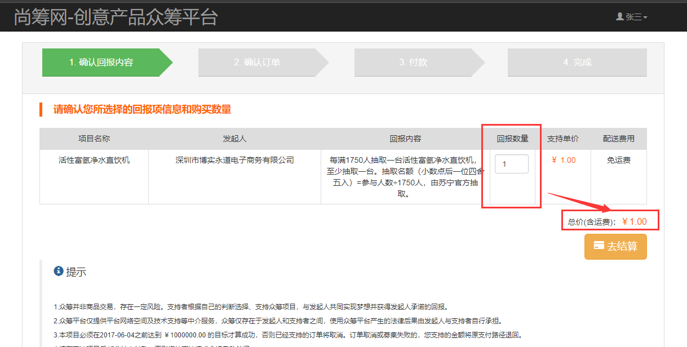
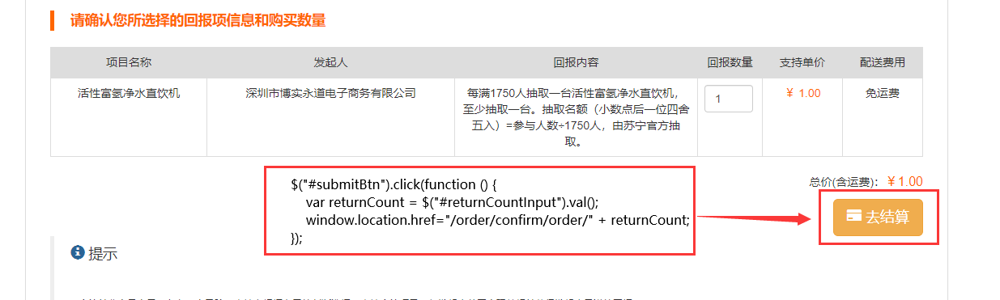

# 一、搭建order-consumer环境

## 1、依赖

​	与前几个消费者模块的依赖基本一致

## 2、application.yml

```yml
server:
  port: 6000
spring:
  application:
    name: crowd-order
  thymeleaf:
    prefix: classpath:/templates/
    suffix: .html
  redis:
    host: 192.168.0.101
  session:
    store-type: redis
eureka:
  client:
    service-url:
      defaultZone: http://localhost:1000/eureka/
```

## 3、在Zuul中添加模块

```yml
zuul:
  ignored-services: "*"       # 表示忽视直接通过application-name访问微服务，必须通过route
  sensitive-headers: "*"      # 在Zuul向其他微服务重定向时，保持原本的头信息（请求头、响应头）
  routes:                     # 指定网关路由
    crowd-protal:
      service-id: crowd-auth  # 对应application-name
      path: /**               # 表示直接通过根路径访问，必须加上**，否则多层路径无法访问
    crowd-project:
      service-id: crowd-project
      path: /project/**
    crowd-order:
      service-id: crowd-order
      path: /order/**
```


# 二、创建对应数据库表

```sql
# 建表t_order（订单表）
CREATE TABLE `t_order` (
    `id` INT NOT NULL AUTO_INCREMENT COMMENT '主键',
    `order_num` CHAR(100) COMMENT '订单号',
    `pay_order_num` CHAR(100) COMMENT '支付宝流水号',
    `order_amount` DOUBLE(10,5) COMMENT '订单金额',
    `invoice` INT COMMENT '是否开发票（0 不开，1 开）',
    `invoice_title` CHAR(100) COMMENT '发票抬头',
    `order_remark` CHAR(100) COMMENT '订单备注',
    `address_id` CHAR(100) COMMENT '收货地址 id', 
	PRIMARY KEY (`id`)
);


# 建表t_address（收货地址表）
CREATE TABLE t_address (
    `id` INT NOT NULL AUTO_INCREMENT COMMENT '主键',
    `receive_name` CHAR(100) COMMENT '收件人',
    `phone_num` CHAR(100) COMMENT '手机号',
    `address` CHAR(200) COMMENT '收货地址',
    `member_id` INT COMMENT '用户 id',
    PRIMARY KEY (`id`)
);


# 建表t_order_project（项目信息表）
CREATE TABLE `t_order_project` (
    `id` INT NOT NULL AUTO_INCREMENT COMMENT '主键',
    `project_name` CHAR(200) COMMENT '项目名称',
    `launch_name` CHAR(100) COMMENT '发起人',
    `return_content` CHAR(200) COMMENT '回报内容',
    `return_count` INT COMMENT '回报数量',
    `support_price` INT COMMENT '支持单价',
    `freight` INT COMMENT '配送费用',
    `order_id` INT COMMENT '订单表的主键', 
    PRIMARY KEY (`id`)
);
```


# 三、页面-确认回报内容


## 1、跳转到确认回报页面

修改project-consumer模块的project-show-detail.html页面代码，使点击支持按钮后跳转到确认回报的页面（需要附带上**当前回报内容的id**）：

```html
<a class="btn btn-warning btn-lg" th:href="'http://localhost/order/confirm/return/info/' + ${return.returnId}">
    支持
</a>
```

通过order-consumer模块的handler方法，进入确认回报页面

```java
    // 进入确认回报信息的页面
    @RequestMapping("/confirm/return/info/{returnId}")
    public String confirmReturnInfo(
            @PathVariable("returnId") Integer returnId,
            HttpSession session) {

        ResultEntity<OrderProjectVO> resultEntity = mySQLRemoteService.getOrderProjectVO(returnId);

        if (ResultEntity.SUCCESS.equals(resultEntity.getResult())){
            session.setAttribute("orderProjectVO", resultEntity.getData());
        }

        return "order-confirm-return";
    }
```


## 2、远程方法

**api接口模块：**

```java
@RequestMapping("/get/order/project/vo/remote")
ResultEntity<OrderProjectVO> getOrderProjectVO(@RequestParam("returnId") Integer returnId);
```

**mysql模块的handler方法：**

```java
@RequestMapping("/get/order/project/vo/remote")
ResultEntity<OrderProjectVO> getOrderProjectVO(@RequestParam("returnId") Integer returnId) {

    try {
        OrderProjectVO orderProjectVO = orderService.getOrderProjectVO(returnId);
        return ResultEntity.successWithData(orderProjectVO);
    } catch (Exception e) {
        e.printStackTrace();
        return ResultEntity.failed(e.getMessage());
    }
}
```

**mysql模块的service实现类方法（接口代码省略）：**

```java
@Override
public OrderProjectVO getOrderProjectVO(Integer returnId) {
    return orderProjectPOMapper.selectOrderProjectVO(returnId);
}
```

mapper接口中，selectOrderProjectVO抽象方法对应的**Mybatis代码：**

```xml
<select id="selectOrderProjectVO" resultType="org.fall.entity.vo.OrderProjectVO">
  select distinct
    project_name projectName,
    description_simple launchName,
    content returnContent,
    count returnCount,
    t_return.supportmoney supportPrice,
    freight,
    signalpurchase signalPurchase,
    purchase
  from t_project
  left join t_member_launch_info on t_project.memberid = t_member_launch_info.memberid
  left join t_return on t_project.id = t_return.projectid
  where t_return.id = #{returnId}
</select>
```


## 3、前台显示

截取，从session域中通过orderProjectVO得到项目与回报的各种信息：

```html
<div class="col-md-12 column">
    <table class="table table-bordered" style="text-align:center;">
        <thead>
        <tr style="background-color:#ddd;">
            <td>项目名称</td>
            <td>发起人</td>
            <td width="300">回报内容</td>
            <td width="80">回报数量</td>
            <td>支持单价</td>
            <td>配送费用</td>
        </tr>
        </thead>
        <tbody>
        <tr>
            <td th:text="${session.orderProjectVO.projectName}">活性富氢净水直饮机</td>
            <td th:text="${session.orderProjectVO.launchName}">深圳市博实永道电子商务有限公司</td>
            <td th:text="${session.orderProjectVO.returnContent}">每满1750人抽取一台活性富氢净水直饮机，至少抽取一台。</td>
            <td >
                <input id="returnCountInput" type="text" class="form-control" style="width:60px;" th:value="${session.orderProjectVO.returnCount}">
            </td>
            <td style="color:#F60">￥[[${session.orderProjectVO.supportPrice}]]</td>
            <td th:if="${session.orderProjectVO.freight} == 0">免运费</td>
            <td th:if="${session.orderProjectVO.freight} > 0" th:text="${session.orderProjectVO.freight}">运费</td>
        </tr>
        </tbody>
    </table>
    <div style="float:right;">
        <p>总价(含运费)：￥
            <span id="totalAmount" style="font-size:16px;color:#F60;" 
                          th:text="${session.orderProjectVO.freight} + (${session.orderProjectVO.supportPrice} * ${session.orderProjectVO.returnCount})">1.00
            </span>
        </p>
        <button id="submitBtn" type="button" class="btn btn-warning btn-lg" style="float:right;" >
            <i class="glyphicon glyphicon-credit-card"></i> 去结算
        </button>
    </div>
</div>
```


为了实现**修改回报数量文本框中的内容，自动修改总价**的功能：



通过一端js代码：

```javascript
var signalPurchase = [[${session.orderProjectVO.signalPurchase}]];

var purchase = [[${session.orderProjectVO.purchase}]];

var freight = [[${session.orderProjectVO.freight}]]

var supportPrice = [[${session.orderProjectVO.supportPrice}]]

// 自动修正总价的功能
// 当id=returnCountInput的标签发送改动时触发
$("#returnCountInput").change(function () {
    // 得到回报数量框内输入的量
    var count = $.trim($(this).val());
    // 判断是否输入了有效数字
    if (count == null || count == "") {
        alert("请输入有效的数字！");
        // 恢复为默认值
        $(this).val(this.defaultValue);
    }
    // 判断是否超过限购数量
    if (signalPurchase == 1 && purchase < count) {
        alert("不能超过限购数量！");
        // 恢复为默认值
        $(this).val(this.defaultValue);
        return ;
    }

    // 满足上述条件 计算最后的总价
    $("#totalAmount").text(freight + supportPrice * count);
});
```


# 四、页面-确认订单


## 1、跳转到确认订单的页面

通过给确认回报内容的页面的**“去结算”**按钮添加单击响应函数：



```javascript
$("#submitBtn").click(function () {
    var returnCount = $("#returnCountInput").val();
    window.location.href="/order/confirm/order/" + returnCount;
});
```


后端handler方法进行跳转操作：

```java
@RequestMapping("/confirm/order/{returnCount}")
public String toConfirmOrderPage(
        @PathVariable("returnCount") Integer returnCount,
        HttpSession session ) {
    
    // 从session域拿到orderProjectVO对象
    OrderProjectVO orderProjectVO = (OrderProjectVO) session.getAttribute("orderProjectVO");

    // 给orderProjectVO设置回报的数量
    orderProjectVO.setReturnCount(returnCount);

    // 重新将orderProjectVO放回session域
    session.setAttribute("orderProjectVO",orderProjectVO);

    // 获取当前的用户的Address对象（即收货地址信息）

    // 1、先得到当前的用户id
    LoginMemberVO loginMember = (LoginMemberVO)session.getAttribute(CrowdConstant.ATTR_NAME_LOGIN_MEMBER);
    Integer memberId = loginMember.getId();

    // 2、通过用户id得到他的收货地址的List
    ResultEntity<List<AddressVO>> resultEntity = mySQLRemoteService.getAddressListByMemberIdRemote(memberId);

    if (ResultEntity.SUCCESS.equals(resultEntity.getResult())) {
        // 3、如果成功，则将收货地址放入session域
        List<AddressVO> addressVOList = resultEntity.getData();
        session.setAttribute("addressVOList", addressVOList);
    }

    // 进入确认订单页面
    return "order-confirm-order";
}
```


## 2、在确认订单页面显示需要的数据

### 显示收货信息

```html
<div th:if="${#strings.isEmpty(session.addressVOList)}" th:text="暂时没有地址信息"></div>
<div th:if="${not #strings.isEmpty(session.addressVOList)}">
    <div th:each="addressVO : ${session.addressVOList}" class="radio">
        <label>
            <input type="radio" name="optionsRadios" id="optionsRadios1" value="option1" th:value="${addressVO.id}" checked>
            [[${addressVO.receiveName}]] [[${addressVO.phoneNum}]]   [[${addressVO.address}]]
        </label>
    </div>
</div>
```

### 显示回报信息与总价格

(详见代码)

```html
<table class="table table-bordered" style="text-align:center;">
    <thead>
    <tr style="background-color:#ddd;">
        <td>项目名称</td>
        <td>发起人</td>
        <td width="300">回报内容</td>
        <td width="80">回报数量</td>
        <td>支持单价</td>
        <td>配送费用</td>
    </tr>
    </thead>
    <tbody>
    <tr>
        <td th:text="${session.orderProjectVO.projectName}">活性富氢净水直饮机</td>
        <td th:text="${session.orderProjectVO.launchName}">深圳市博实永道电子商务有限公司</td>
        <td th:text="${session.orderProjectVO.returnContent}">每满1750人抽取一台活性富氢净水直饮机，至少抽取一台。抽取名额</td>
        <td th:text="${session.orderProjectVO.returnCount}"></td>
        <td style="color:#F60">￥[[${session.orderProjectVO.supportPrice}]]</td>
        <td th:if="${session.orderProjectVO.freight} == 0">免运费</td>
        <td th:if="${session.orderProjectVO.freight} > 0" th:text="${session.orderProjectVO.freight}">运费</td>
    </tr>
    </tbody>
</table>
<!-- ... ... -->
<ul style="list-style:none;" >
	<li style="margin-top:10px;">支持金额：<span style="color:red;">￥[[${session.orderProjectVO.returnCount} * ${session.orderProjectVO.supportPrice}]]</span></li>
	<li style="margin-top:10px;">配送费用：<span style="color:red;">￥[[${session.orderProjectVO.freight}]]</span></li>
    <li style="margin-top:10px;margin-bottom:10px;">
        <h2>支付总金额：
        	<span style="color:red;">
           ￥[[${session.orderProjectVO.freight}+(${session.orderProjectVO.supportPrice}*${session.orderProjectVO.returnCount})]]
        	</span>
        </h2>
    </li>
    <li style="margin-top:10px;padding:5px;border:1px solid #F00;display:initial;background:#FFF;">
		<i class="glyphicon glyphicon-info-sign"></i> 
        <strong>您需要先 <a href="#address">设置配送信息</a> ,再提交订单</strong>
    </li>
    <li style="margin-top:10px;">
		请在下单后15分钟内付款，否则您的订单会被自动关闭。
	</li>
    <li style="margin-top:10px;">
    	<button disabled="disabled" type="button" class="btn btn-warning btn-lg">
            <i class="glyphicon glyphicon-credit-card"></i> 立即付款
        </button>
    </li>
    <li style="margin-top:10px;">
    	<div class="checkbox">
        	<label>
            	<input type="checkbox" checked> 我已了解风险和规则
			</label>
		</div>
	</li>
</ul>
```


## 3、新增收货地址功能

修改原始的新地址的表单，加上action、method、name等：

```html
<form action="/order/save/address" method="post" class="form-horizontal">
    <input type="hidden" name="memberId" th:value="${session.loginMember.id}">
    <div class="form-group">
        <label class="col-sm-2 control-label">收货人（*）</label>
        <div class="col-sm-10">
            <input name="receiveName" type="text" class="form-control" style="width:200px;" placeholder="请填写收货人姓名" >
        </div>
    </div>
    <div class="form-group">
        <label class="col-sm-2 control-label">手机（*）</label>
        <div class="col-sm-10">
            <input name="phoneNum" class="form-control" type="text" style="width:200px;" placeholder="请填写11位手机号码"></input>
        </div>
    </div>
    <div class="form-group">
        <label class="col-sm-2 control-label">地址（*）</label>
        <div class="col-sm-10">
            <input name="address" class="form-control" type="text" style="width:400px;" placeholder="请填写收货地址"></input>
        </div>
    </div>
    <div class="form-group">
        <label for="inputEmail3" class="col-sm-2 control-label"></label>
        <div class="col-sm-10">
            <button type="submit" class="btn btn-primary">确认配送信息</button>
        </div>
    </div>
</form>
```

**后端handler接收**

```java
@RequestMapping("/save/address")
public String saveAddress(AddressVO addressVO, HttpSession session) {

    // 通过远程方法保存地址信息
    ResultEntity<String> resultEntity = mySQLRemoteService.saveAddressRemote(addressVO);

    // 从session域得到当前的orderProjectVO
    OrderProjectVO orderProjectVO = (OrderProjectVO) session.getAttribute("orderProjectVO");
    
    // 得到当前的回报数量
    Integer returnCount = orderProjectVO.getReturnCount();

    // 再次重定向到确认订单的页面（附带回报数量）
    return "redirect:http://localhost/order/confirm/order/" + returnCount;
}
```


**api接口模块：**

```java
@RequestMapping("/save/address/remote")
ResultEntity<String> saveAddressRemote(@RequestBody AddressVO addressVO);
```

**mysql模块的远程方法：**

```java
@RequestMapping("/save/address/remote")
ResultEntity<String> saveAddressRemote(@RequestBody AddressVO addressVO) {
    try {
        orderService.saveAddressPO(addressVO);
        return ResultEntity.successWithoutData();
    } catch (Exception e) {
        e.printStackTrace();
        return ResultEntity.failed(e.getMessage());
    }
}
```

**service层方法：**

```java
@Transactional(propagation = Propagation.REQUIRES_NEW, rollbackFor = Exception.class)
@Override
public void saveAddressPO(AddressVO addressVO) {
    AddressPO addressPO = new AddressPO();
    BeanUtils.copyProperties(addressVO,addressPO);
    addressPOMapper.insert(addressPO);
}
```


## 4、控制“立即付款”按钮是否有效

通过js代码实现勾选**“我已了解风险和规则”**后才能点击立即付款

下面两个标签设置id，付款按钮默认是disabled的

```html
<li style="margin-top:10px;">
    <button id="payBtn" disabled="disabled" type="button" class="btn btn-warning btn-lg" onclick="window.location.href='pay-step-3.html'">
        <i class="glyphicon glyphicon-credit-card"></i> 立即付款
    </button>
</li>
<li style="margin-top:10px;">
    <div class="checkbox">
        <label>
            <input id="knowCheckbox" type="checkbox"> 我已了解风险和规则
        </label>
    </div>
</li>
```

js代码：

```html
<script>
    $("#knowCheckbox").click(function () {
        // 得到当前的勾选状态
        var currentStatus = this.checked;
        // 根据是否勾选，设置付款按钮是否可用
        if (currentStatus) {
            $("#payBtn").prop("disabled","");
        } else {
            $("#payBtn").prop("disabled","disabled");
        }
    });
</script>
```


