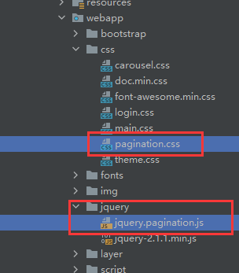

# 管理员登录与维护


## 一、管理员登陆

需要做的：

1. 对存入数据库的密码进行MD5加密
2. 在登录界面登录失败时的处理
3. 抽取后台页面的公共部分
4. 检查登录状态，防止未登录时访问受保护资源的情况

具体操作如下：

### 1）、MD5加密

​	使用到的CrowdConstant类中的一些常量：

```java
public class CrowdConstant {
    public static final String ATTR_NAME_EXCEPTION = "exception";
    public static final String MESSAGE_LOGIN_FAILED = "登录失败！请确认账号密码是否正确";
    public static final String MESSAGE_STRING_INVALIDATE = "字符串不能为空或长度为0！";
    public static final String MESSAGE_SYSTEM_ERROR_LOGIN_NOT_UNIQUE = "错误！数据库中存在重复数据！";
    //登录的用户名
    public static final String LOGIN_ADMIN_NAME = "loginAdmin";
    public static final String MESSAGE_ACCESS_FORBIDDEN = "还未登录，禁止访问受保护资源！";
}
```

​	进行**加密的工具方法**：

```java
public class CrowdUtil {
    //...其他工具方法省略
    /**
     * 此方法是用于给字符串进行md5加密的工具方法
     * @return 进行md5加密后的结果
     * @param source 传入要加密的内容
     */
    public static String md5(String source){

        if (source == null || source.length() == 0) {
            //如果传入的加密内容为空或是空字符串，抛出LoginFailedException
            throw new LoginFailedException(CrowdConstant.MESSAGE_STRING_INVALIDATE);
        }

        try {
            //表示算法名
            String algorithm = "md5";

            //得到MessageDigest对象，设置加密方式为md5
            MessageDigest messageDigest = MessageDigest.getInstance(algorithm);

            //将获得的明文字符串转换为字节数组
            byte[] input = source.getBytes();

            //对转换得到的字节数组进行md5加密
            byte[] output = messageDigest.digest(input);

            //设置BigInteger的signum
            //signum : -1表示负数、0表示零、1表示正数
            int signum = 1;

            //将字节数组转换成Big Integer
            BigInteger bigInteger = new BigInteger(signum,output);

            //设置将bigInteger的值按照16进制转换成字符串，最后全部转换成大写，得到最后的加密结果
            int radix = 16;
            String encoded = bigInteger.toString(radix).toUpperCase();

            //返回加密后的字符串
            return encoded;
        } catch (NoSuchAlgorithmException e) {
            e.printStackTrace();
        }

        //触发异常则返回null
        return null;
    }
}
```

### 	2）、判断登录是否成功	

在出现账号密码不正确、密码为空等情况时抛出的异常（继承了RuntimeException）：

```java
/**
 * 登录失败后抛出的异常
 */
public class LoginFailedException extends RuntimeException {
    public LoginFailedException() {
        super();
    }
    public LoginFailedException(String message) {
        super(message);
    }
    public LoginFailedException(String message, Throwable cause) {
        super(message, cause);
    }
    public LoginFailedException(Throwable cause) {
        super(cause);
    }
    protected LoginFailedException(String message, Throwable cause, boolean enableSuppression, boolean writableStackTrace) {
        super(message, cause, enableSuppression, writableStackTrace);
    }
}
```

​	在**【1环境搭建】**中已经创建的**CrowdExceptionResolver**异常处理器类中添加针对该异常的处理方法：

```java
// 触发登录失败异常，则继续返回登陆页面
@ExceptionHandler(value = LoginFailedException.class)
public ModelAndView resolverLoginFailedException(
        LoginFailedException exception, HttpServletRequest request,
        HttpServletResponse response) throws IOException {
    String viewName = "admin-login";
    // （公共代码方法，前面文档已经写过）
    return commonCode(exception,request,response,viewName);
}
```

​	可以在登录页面加的适当位置一句下面的代码，以达到**提示异常信息**的目的：

```jsp
<p>${requestScope.exception.message}</p>
```

​	

​	编写**Service层代码**：

​	主要时根据账号从数据库中取出对应的Admin对象，并与前端传来的账号密码进行比对

```java
@Override
public Admin getAdminByUsername(String adminLoginAcct, String adminPassword) {
    // 1、根据登陆账号查询Admin对象

    // 创建AdminExample对象
    AdminExample adminExample = new AdminExample();

    // 创建Criteria对象
    AdminExample.Criteria criteria = adminExample.createCriteria();

    // 在Criteria对象中封装查询的条件
    criteria.andLoginAcctEqualTo(adminLoginAcct);

    // 调用AdminMapper的方法来查询
    List<Admin> admins = adminMapper.selectByExample(adminExample);

    // 2、判断Admin对象是否为null或数据库数据不正常
    if (admins == null || admins.size() == 0){
        throw new LoginFailedException(CrowdConstant.MESSAGE_LOGIN_FAILED);
    }
    if (admins.size() > 1){
        // 数据库的数据存在重复
        throw new LoginFailedException(CrowdConstant.MESSAGE_SYSTEM_ERROR_LOGIN_NOT_UNIQUE);
    }

    // 前面判断完后无异常，取出admin对象
    Admin admin = admins.get(0);

    // 3、如果Admin对象为null 则抛出异常
    if (admin == null){
        throw new LoginFailedException(CrowdConstant.MESSAGE_LOGIN_FAILED);
    }

    // 4、如果Admin对象不为null，则取出Admin对象的密码
    String userPswdDB = admin.getUserPswd();

    // 5、对表单提交的密码进行md5加密
    String userPswdForm = CrowdUtil.md5(adminPassword);

    // 6、对比两个密码
    // 因为两个密码都是对象，使用字符串的equals方法，如果存在空的密码则会触发空指针异常
    // 因此选用Objects.equals方法
    if (!Objects.equals(userPswdDB,userPswdForm)){
        // 密码不匹配
        throw new LoginFailedException(CrowdConstant.MESSAGE_LOGIN_FAILED);
    }

    // 7、比对结果一致，返回admin对象
    return admin;
}
```


​	编写在登录页面点击登录时对应的**Controller代码**：（Controller层调用Service层）

```java
//登录操作的handler
@RequestMapping("/admin/login/doLogin.html")
public String doLogin(
        @RequestParam("login-user") String username,
        @RequestParam("login-pwd") String password,
        HttpSession session) {
    //通过service层方法得到Admin对象
    Admin admin = adminService.getAdminByUsername(username,password);

    //将Admin对象放入Session域
    session.setAttribute(CrowdConstant.LOGIN_ADMIN_NAME, admin);

    //重定向到登录完成后的主页面（重定向防止重复提交表单，增加不必要的数据库访问）
    return "redirect:/admin/main/page.html";
}
```

​	重定向去的页面，因为数据放在session中，因此直接通过mvc:view-controller指定该页面	

```xml
<mvc:view-controller path="/admin/main/page.html" view-name="admin-main"/>
```

​	若此时比对后，账号密码均符合数据库数据，则进入登录后的主页面==**/WEB-INF/admin-main.jsp**==（前端代码大多重复，不在这边复制出来）

​	这里主要有一句前端代码，用来显示已经登录的账号的昵称（从Session中取出）

```jsp
<div class="btn-group">
    <button type="button" class="btn btn-default btn-success dropdown-toggle" data-toggle="dropdown">
        <i class="glyphicon glyphicon-user"></i> ${sessionScope.loginAdmin.userName} <span class="caret"></span>
    </button>
    ...
</div>
```

### 3）、抽取后台公共页面

​	JSP页面中，对公共的页面，可以在一个单独页面中保存，在需要调用这些公共页面的时候通过`<%@include file="..."%>`引入这些页面。

​	注意：如果在引入时，发现引入的地方原本的**中文显示乱码**，可以通过给这些公共的页面代码加上一句`<%@page pageEncoding="UTF-8"%>`

​	这里以抽取的头部标签栏为例（include-nav.jsp）：

```jsp
<%@page pageEncoding="UTF-8"%>
<nav class="navbar navbar-inverse navbar-fixed-top" role="navigation">
    <div class="container-fluid">
        <div class="navbar-header">
            <div><a class="navbar-brand" style="font-size:32px;" href="#">众筹平台 - 控制面板</a></div>
        </div>
        <div id="navbar" class="navbar-collapse collapse">
            <ul class="nav navbar-nav navbar-right">
                <li style="padding-top:8px;">
                    <div class="btn-group">
                        <button type="button" class="btn btn-default btn-success dropdown-toggle" data-toggle="dropdown">
                            <i class="glyphicon glyphicon-user"></i> ${sessionScope.loginAdmin.userName} <span class="caret"></span>
                        </button>
                        <ul class="dropdown-menu" role="menu">
                            <li><a href="#"><i class="glyphicon glyphicon-cog"></i> 个人设置</a></li>
                            <li><a href="#"><i class="glyphicon glyphicon-comment"></i> 消息</a></li>
                            <li class="divider"></li>
                            <li><a href="admin/login/logout.html"><i class="glyphicon glyphicon-off"></i> 退出系统</a></li>
                        </ul>
                    </div>
                </li>
                <li style="margin-left:10px;padding-top:8px;">
                    <button type="button" class="btn btn-default btn-danger">
                        <span class="glyphicon glyphicon-question-sign"></span> 帮助
                    </button>
                </li>
            </ul>
            <form class="navbar-form navbar-right">
                <input type="text" class="form-control" placeholder="查询">
            </form>
        </div>
    </div>
</nav>
```

在对应的页面引入：

```jsp
<body>
    <%-- 头部标签的引入放在原本的位置，代替重复代码 --%>
    <%@include file="/WEB-INF/include-nav.jsp"%>
    ...
</body>
```

### 4）、对登录状态进行检查

主要是通过一个异常配合一个拦截器来实现。

​	①首先创建一个自定义异常AccessForbiddenException，在用户未登录时访问受保护资源时抛出：

```java
// 未登录时访问受保护资源时抛出的异常
public class AccessForbiddenException extends RuntimeException{

    public AccessForbiddenException() {
        super();
    }

    public AccessForbiddenException(String message) {
        super(message);
    }

    public AccessForbiddenException(String message, Throwable cause) {
        super(message, cause);
    }

    public AccessForbiddenException(Throwable cause) {
        super(cause);
    }

    protected AccessForbiddenException(String message, Throwable cause, boolean enableSuppression, boolean writableStackTrace) {
        super(message, cause, enableSuppression, writableStackTrace);
    }
}
```

​	②然后创建一个拦截器，拦截除了登录页面、登录请求、登出操作的其他请求，只有能从session域中得到admin对象时，才可以放行：

```java
// 拦截器，用来在未登录时访问受保护页面时进行拦截并抛出AccessForbiddenException
public class LoginInterceptor extends HandlerInterceptorAdapter {

    @Override
    public boolean preHandle(HttpServletRequest request, HttpServletResponse response, Object handler) throws Exception {
        // 通过request获得session对象
        HttpSession session = request.getSession();

        // 从session域中取出Admin对象
        Admin admin = (Admin) session.getAttribute(CrowdConstant.LOGIN_ADMIN_NAME);

        // 判断admin对象是否为空，若为空表示未登录，抛出异常
        if (admin == null){
            throw new AccessForbiddenException(CrowdConstant.MESSAGE_ACCESS_FORBIDDEN);
        }

        // admin对象不为空，表示已登录，放行
        return true;
    }
}
```

​	③在SpringMVC的容器中注册拦截器：

```xml
<!--在mvc容器中注册拦截器-->
<mvc:interceptors>
    <mvc:interceptor>
        <!-- mapping 表示拦截的路径 -->
        <mvc:mapping path="/**"/>
        <!-- exclude-mapping表示例外（即不会被拦截器拦截） -->
        <mvc:exclude-mapping path="/admin/login/page.html"/>
        <mvc:exclude-mapping path="/admin/login/logout.html"/>
        <mvc:exclude-mapping path="/admin/login/doLogin.html"/>
        <bean class="org.fall.mvc.interceptor.LoginInterceptor"/>
    </mvc:interceptor>
</mvc:interceptors>
```

​	④完善异常映射，在未登录时，触发该异常，应该自动跳转到登陆页面：

```xml
<!--基于XML的异常映射-->
<bean class="org.springframework.web.servlet.handler.SimpleMappingExceptionResolver" id="simpleMappingExceptionResolver">
    <property name="exceptionMappings">
        <props>
            <prop key="java.lang.Exception">system-error</prop>
            <!-- 通过xml配置AccessForbiddenException的异常映射 -->
            <prop key="org.fall.exception.AccessForbiddenException">admin-login</prop>
        </props>
    </property>
</bean>
```

​	**注意**：经测试，此处不能直接使用基于注解的异常处理。直接使用@ExceptionHandler注解捕捉异常在访问/admin/main/page.html时不会进入该方法
​        原因是：上面的/admin/main/page.html视图是在mvc的配置文件中用**mvc:view-controller**修饰的，这种页面，会使用默认的异常处理器
​        而不是使用自定义处理器。

​	==因此这里必须通过mvc配置文件来配置异常映射；==

​	==或不使用view-controller修饰/admin/main/page.html，而是把该页面的跳转 放在Controller中。==


## 二、管理员维护

​	对管理员进行维护：主要目的就是在前端页面友好地显示当前数据库中的管理员数据信息，并且能对其中数据进行增删改查操作。

**需要做的：**

1. 分页显示管理员的信息

  		2. 实现根据关键字查询对应信息
    		3. 实现从列表删除指定管理员
      		4. 实现新增管理员
        		5. 实现修改管理员信息


### 1）、分页显示信息

#### ①引入依赖	

​	为了实现方便，使用了基于jQuery的Pagination插件，实现**显示页码导航条**

​	本项目中使用的Pagination版本是1.2；这里将对应的js文件放在jquery文件夹下，css文件放在css文件夹下：



​	引入PageHelper，用于在后端进行分页的操作，避免自己再麻烦地去写分页的代码：

```xml
<!-- MyBatis 分页插件 -->
<dependency>
    <groupId>com.github.pagehelper</groupId>
    <artifactId>pagehelper</artifactId>
    <version>4.0.0</version>
</dependency>
```

#### ②后端代码

​	1、编写查询Admin信息的SQL语句：

```xml
<!--逆向工程生成的，可以用于引入重复数据-->
<sql id="Base_Column_List" >
  id, login_acct, user_pswd, user_name, email, create_time
</sql>

<!--查找符合关键字匹配的数据（没有关键字则默认查找全部数据）-->
<select id="selectAdminByKeyword" resultMap="BaseResultMap">
  select 
  <!--引入前面的sql标签中的内容-->
  <include refid="Base_Column_List"/>
  from t_admin
  where
  login_acct like CONCAT("%",#{keyword},"%") or
  user_name like CONCAT("%",#{keyword},"%") or
  email like CONCAT("%",#{keyword},"%")
</select>
```

​	2、再AdminMapper接口中编写抽象方法：

```java
//根据关键字查找用户的方法
List<Admin> selectAdminByKeyword(String keyword);
```

​	

​	3、在Spring配置文件中原先编写的SqlSessionFactoryBean中加入MyBatis插件—PageHelper

```xml
<bean class="org.mybatis.spring.SqlSessionFactoryBean" id="sqlSessionFactoryBean">
    <property name="configLocation" value="classpath:mybatis/mybatis-config.xml"/>
    <property name="mapperLocations" value="classpath:mybatis/mapper/*.xml"/>
    <property name="dataSource" ref="dataSource"/>
    
    <!--配置插件-->
    <property name="plugins">
        <array>
            <!--配置PageHelper，用于帮助分页-->
            <bean class="com.github.pagehelper.PageHelper">
                <property name="properties">
                    <props>
                        <!--设置数据库方言（这里就是mysql）-->
                        <prop key="dialect">mysql</prop>
                        <!--让PageHelper自动将浏览器传来的PageNum修正到正确范围-->
                        <prop key="reasonable">true</prop>
                    </props>
                </property>
            </bean>
        </array>
    </property>
    
</bean>
```

​	

​	4、在Service层调用该方法，实现查询操作

​	AdminService接口抽象getPageInfo()在实现类的代码：

```java
/**
 * @param keyword 关键字
 * @param pageNum 当前页码
 * @param pageSize 每一页显示的信息数量
 * @return 最后的pageInfo对象
 */
@Override
public PageInfo<Admin> getPageInfo(String keyword, Integer pageNum, Integer pageSize) {
    // 利用PageHelper的静态方法开启分页
    PageHelper.startPage(pageNum,pageSize);

    // 调用Mapper接口的对应方法
    List<Admin> admins = adminMapper.selectAdminByKeyword(keyword);

    // 为了方便页面的使用，把Admin的List封装成PageInfo（放别得到页码等数据）
    PageInfo<Admin> pageInfo = new PageInfo<>(admins);

    // 返回得到的pageInfo对象
    return pageInfo;
}
```

​	这里使用PageInfo作为返回值，是因为PageInfo对象中可以携带当前的页码、每页大小、总页数等数据，在前端取值时，比直接返回一个Admin的List更加方便。


​	5、编写Controller层代码：

```java
//显示admin的数据
@RequestMapping("/admin/page/page.html")
public String getAdminPage(
        // 传入的关键字，若未传入，默认值为一个空字符串（不能是null）
        @RequestParam(value = "keyword", defaultValue = "") String keyword,
        // 传入的页码，默认值为1
        @RequestParam(value = "pageNum", defaultValue = "1") Integer pageNum,
        // 传入的页面大小，默认值为5
        @RequestParam(value = "pageSize", defaultValue = "5") Integer pageSize,
    	// ModelMap用于给前端带数据
        ModelMap modelMap) {
    
    //从AdminService中得到对应传参的列表
    PageInfo<Admin> pageInfo = adminService.getPageInfo(keyword, pageNum, pageSize);
    
    //将得到的PageInfo存入modelMap，传给前端
    modelMap.addAttribute(CrowdConstant.NAME_PAGE_INFO,pageInfo);
    
    //进入对应的显示管理员信息的页面（/WEB-INF/admin-page.jsp）
    return "admin-page";
}
```

#### ③前端代码	

​	在admin-sidebar.jsp页面设置“用户维护”按钮的跳转链接，到controller层的对应RequestMapping

```jsp
<li style="height:30px;">
    <a href="admin/page/page.html"><i class="glyphicon glyphicon-user"></i> 用户维护</a>
</li>
```


​		实现在前端页面显示这些得到的数据：

​		为了做判断后再获取各个数据，这里需要引入JSTL：

```jsp
<%@taglib prefix="c" uri="http://java.sun.com/jsp/jstl/core" %>
```

​		这里显示管理员信息的主要代码：

```jsp
<thead>
<tr>
    <th width="30">#</th>
    <th width="30"><input type="checkbox"></th>
    <th>账号</th>
    <th>名称</th>
    <th>邮箱地址</th>
    <th width="100">操作</th>
</tr>
</thead>
<tbody>

<%-- jstl --%>
    <%-- 如果得到的pageInfo的list为空，则表示数据库无数据，显示查不到数据 --%>
<c:if test="${empty requestScope.pageInfo.list}">
    <tr>
        <td colspan="6">抱歉，查不到相关的数据！</td>
    </tr>
</c:if>
    <%-- 数据不为空，通过forEach显示数据（前端显示的主要代码） --%>
<c:if test="${!empty requestScope.pageInfo.list}">
    <c:forEach items="${requestScope.pageInfo.list}" var="admin" varStatus="status">
        <tr>
            <td>${status.count}</td>
            <td><input type="checkbox"></td>
            <td>${admin.loginAcct}</td>
            <td>${admin.userName}</td>
            <td>${admin.email}</td>
            
            <%-- 这里下面的按钮还未用到，先忽略 --%>
            <td>
                <button type="button" class="btn btn-success btn-xs"><i
                        class=" glyphicon glyphicon-check"></i></button>
                <a href="admin/page/update/${admin.id}/${requestScope.pageInfo.pageNum}/${param.keyword}.html" 
                   class="btn btn-primary btn-xs"><i class=" glyphicon glyphicon-pencil"></i></a>
                <a href="admin/page/remove/${admin.id}/${requestScope.pageInfo.pageNum}/${param.keyword}.html" 
                   class="btn btn-danger btn-xs">
                    <i class=" glyphicon glyphicon-remove"></i>
                </a>
            </td>
        </tr>
    </c:forEach>
</c:if>

</tbody>
```

​		此时前端已经可以显示被分页后的数据，但是还不能通过导航条来选择页码，这时候需要使用Pagination。

```jsp
<%--引入pagination的css--%>
<link href="css/pagination.css" rel="stylesheet" />
<%--引入基于jquery的paginationjs--%>
<script type="text/javascript" src="jquery/jquery.pagination.js"></script>
<script type="text/javascript">
    $(function () {
        // 调用一个函数
       initPagination();
    });

    function initPagination(){
        // 获取分页数据中的总记录数
        var totalRecord = ${requestScope.pageInfo.total};

        // 声明Pagination设置属性的JSON对象
        var properties = {
            num_edge_entries: 3,                                // 边缘页数
            num_display_entries: 5,                             // 主体页数
            callback: pageSelectCallback,                       // 点击各种翻页反扭时触发的回调函数（执行翻页操作）
            current_page: ${requestScope.pageInfo.pageNum-1},   // 当前页码
            prev_text: "上一页",                                 // 在对应上一页操作的按钮上显示的文本
            next_text: "下一页",                                 // 在对应下一页操作的按钮上显示的文本
            items_per_page: ${requestScope.pageInfo.pageSize}   // 每页显示的数量
        };
		// pagination()方法就是上面的js文件提供的，需要传入总记录数与上面的json对象
        $("#Pagination").pagination(totalRecord,properties);
    }

    // 回调函数的代码
    function pageSelectCallback(pageIndex, jQuery){
        // pageIndex是当前点击的页码的索引，索引从0开始计算，因此比pageNum小1
        var pageNum = pageIndex+1;

        // 执行页面跳转（带页码与关键字）
        window.location.href = "admin/page/page.html?pageNum="+pageNum+"&keyword=${param.keyword}";

        // 取消当前超链接的默认行为
        return false;
    }
</script>
```

​		**注意：**这里的**jquery.pagination.js**源代码会在绘制完整个导航条后，自动调用回调函数，这样会造成代码死循环，因此需要将调用回调函数的代码去掉。


经过测试，此时分页显示的功能已经实现。


### 2）、实现关键字查询

​	找到页面中执行查询操作的部分，修改代码成如下：

​		主要设置了该form表单的action、method、输入框的name、输入框的value

```jsp
<form class="form-inline" action="admin/page/page.html" method="post" role="form" style="float:left;">
    <div class="form-group has-feedback">
        <div class="input-group">
            <div class="input-group-addon">查询条件</div>
            <input class="form-control has-success" name="keyword" type="text" placeholder="请输入查询条件" value="${param.keyword}"/>
        </div>
    </div>
    <button type="submit" class="btn btn-warning"><i class="glyphicon glyphicon-search"></i> 查询
    </button>
</form>
```

​	action指向controller层的查询的方法，且在表单中，附带了 name="keyword" 的数据，也就将keyword带给了后端，后端通过@RequestParam接收keyword，传递给service层等等后续操作。

​	且前面的分页js代码中，通过回调函数的跳转链接中给keyword传值：

`window.location.href = "admin/page/page.html?pageNum="+pageNum+"&keyword=${param.keyword}";`

可以使在使用换页操作时，仍然带着关键词换页（要注意的是，这里因为有时候keyword并没有，因此keyword传值必须放在链接的最后一个位置，否则可能会引起错误：如==keyword=&pageNum=2==这样的url是有问题的）


### 3）、删除管理员


#### 	①后端代码

​	

​	Controller层代码：

```java
    @RequestMapping("/admin/page/remove/{adminId}/{pageNum}/{keyword}.html")
    public String removeAdmin(
            // 从前端获取的管理员id
            @PathVariable("adminId") Integer adminId,
            // 从前端获取的当前页码与关键字（为了删除后跳转的页面仍然是刚才的页面，优化体验）
            @PathVariable("pageNum") Integer pageNum,
            @PathVariable("keyword") String keyword){
        
        // 调用service层方法，从数据库根据id删除管理员
        adminService.removeById(adminId);
        
        //删除完成后，重定向（减少数据库操作）返回信息页
        return "redirect:/admin/page/page.html?pageNum="+pageNum+"&keyword="+keyword;
    }
```

​	Service层代码：

（这里其实需要做一些判断：如不能删除现在登录的管理员账号等，但是这里仅仅是作为练习，此处就不写了；另外，在正式的项目中，一般不会将数据库中的信息完全抹去，因为抹去后恢复就很难了，一般可以在表中设置一个状态码，如1表示用户可用，0表示不可用，也就代表被删除了）

```java
// 根据id删除管理员
@Override
public void removeById(Integer adminId) {
    // Mapper接口的方法，根据主键id删除管理员
    adminMapper.deleteByPrimaryKey(adminId);
}
```


#### 	②前端代码

​	修改原本对应修改按钮处的代码成如下：

```jsp
<a href="admin/page/remove/${admin.id}/${requestScope.pageInfo.pageNum}/${param.keyword}.html" class="btn btn-danger btn-xs">
    <i class=" glyphicon glyphicon-remove"></i>
</a>
```

​	删除管理员功能至此就实现了。


### 4）、增加管理员

​	通过一个新增按钮，跳转到新增页面，进行新增管理员的数据填写，然后存入数据库。


#### 	

#### 	①数据库操作

​		数据库中给loginAcct设置唯一约束（防止添加管理员时使用重复的登录账号）

```sql
ALTER TABLE t_admin ADD UNIQUE INDEX(login_acct)
```

​		这里判断login_acct是否唯一最好是放在数据库中判断，如果简单地放后端代码中判断，可能会出现同时添加同一个login_acct操作，由于代码执行前后的原因导致最后写入了一样的login_acct，而通过数据库设置唯一约束，则可以从根本避免出现重复数据。

#### 	②前端代码：

​	新增按钮修改成如下：

```jsp
<a href="admin/page/save.html" class="btn btn-primary" style="float:right;"><i class="glyphicon glyphicon-plus">新增</i></a>
```

​	因为该跳转不需要携带数据等操作，所以直接使用view-controller来跳转

```xml
<!--前往注册admin页面-->
<mvc:view-controller path="/admin/page/save.html" view-name="admin-add"/>
```

​	admin-add.jsp页面代码（主要看添加数据的表单）：

​	主要做了name属性、action、method的修改，修改为与Admin实体类对象对应的模式

```jsp
<div class="col-sm-9 col-sm-offset-3 col-md-10 col-md-offset-2 main">
    <ol class="breadcrumb">
        <li><a href="admin/main/page.html">首页</a></li>
        <li><a href="admin/page/page.html">数据列表</a></li>
        <li class="active">新增</li>
    </ol>
    <div class="panel panel-default">
        <div class="panel-heading">表单数据<div style="float:right;cursor:pointer;" data-toggle="modal" data-target="#myModal"><i class="glyphicon glyphicon-question-sign"></i></div></div>
        <div class="panel-body">
            <form action="admin/page/doSave.html" method="post" role="form">
                <p>${requestScope.exception.message}</p>
                <div class="form-group">
                    <label for="exampleInputPassword1">登录账号</label>
                    <input type="text" name="loginAcct" class="form-control" id="exampleInputPassword1" placeholder="请输入登录账号">
                </div>
                <div class="form-group">
                    <label for="exampleInputPassword1">用户密码</label>
                    <input type="text" name="userPswd" class="form-control" id="exampleInputPassword1" placeholder="请输入用户密码">
                </div>
                <div class="form-group">
                    <label for="exampleInputPassword1">用户昵称</label>
                    <input type="text" name="userName" class="form-control" id="exampleInputPassword1" placeholder="请输入用户昵称">
                </div>

                <div class="form-group">
                    <label for="exampleInputEmail1">邮箱地址</label>
                    <input type="email" name="email" class="form-control" id="exampleInputEmail1" placeholder="请输入邮箱地址">
                    <p class="help-block label label-warning">请输入合法的邮箱地址, 格式为： xxxx@xxxx.com</p>
                </div>
                <button type="submit" class="btn btn-success"><i class="glyphicon glyphicon-plus"></i> 新增</button>
                <button type="reset" class="btn btn-danger"><i class="glyphicon glyphicon-refresh"></i> 重置</button>
            </form>
        </div>
    </div>
</div>
```

#### 	③后端代码

​		Controller层代码：

```java
@RequestMapping("/admin/page/doSave.html")
public String addAdmin(Admin admin){
    // 调用service层存储admin对象的方法
    adminService.saveAdmin(admin);
    
    // 重定向会原本的页面，且为了能在添加管理员后看到管理员，设置pageNum为整型的最大值（通过修正到最后一页）
    return "redirect:/admin/page/page.html?pageNum="+Integer.MAX_VALUE;
}
```

​	Service层代码：

```java
@Override
public void saveAdmin(Admin admin) {
    // 生成当前系统时间
    Date date = new Date();
    
    // 格式化时间
    SimpleDateFormat simpleDateFormat = new SimpleDateFormat("yyyy-MM-dd HH:mm:ss");
    String createTime = simpleDateFormat.format(date);
    // 设置管理员创建时间
    admin.setCreateTime(createTime);
    
    // 得到前端传入的密码，加密并放回原本的admin对象
    String source = admin.getUserPswd();
    String encoded = CrowdUtil.md5(source);
    admin.setUserPswd(encoded);
    
    // 执行插入操作
    try {
        adminMapper.insert(admin);
    } catch (Exception e){
        e.printStackTrace();
        // 这里出现异常的话一般就是DuplicateKeyException（因为插入的loginAcct已存在而触发）
        if(e instanceof DuplicateKeyException){
            // 如果确实是DuplicateKeyException，此时抛出一个自定义的异常
            throw new LoginAcctAlreadyInUseException(CrowdConstant.MESSAGE_SYSTEM_ERROR_LOGIN_NOT_UNIQUE);
        }
    }
}
```

​	这里LoginAcctAlreadyInUseException依然是继承了RuntimeException，因此不重复写了。

​	因为会抛出异常，编写异常处理类：

```java
// 新增管理员时，login_acct已存在，则返回admin-add.jsp页面，附带异常信息
@ExceptionHandler(value = LoginAcctAlreadyInUseException.class)
public ModelAndView resolverLoginAcctAlreadyInUseException(
        LoginAcctAlreadyInUseException exception, HttpServletRequest request,
        HttpServletResponse response) throws IOException {
    String viewName = "admin-add";
    return commonCode(exception,request,response,viewName);
}
```

​	在前端显示异常信息：


### 5）、更新管理员信息

​	实现效果：通过管理员信息页面的铅笔按钮，进入修改页面，且页面中存在了对应管理员的现有信息，通过修改这些信息后点击更新按钮，实现管理员信息根系


​	

修改铅笔按钮处代码，

携带当前管理员的id（用于显示要修改的管理员信息）、当前页面、关键字（用于修改完后的跳转）：

```jsp
<a href="admin/page/update/${admin.id}/${requestScope.pageInfo.pageNum}/${param.keyword}.html" 
   class="btn btn-primary btn-xs"><i class=" glyphicon glyphicon-pencil"></i></a>
```

​	对应该请求的Controller方法：

```java
    @RequestMapping("/admin/page/update/{adminId}/{pageNum}/{keyword}.html")
    public String toUpdatePage(
            @PathVariable("adminId") Integer adminId,
            @PathVariable("pageNum") Integer pageNum,
            @PathVariable("keyword") String keyword,
            ModelMap modelMap){
        // 调用Service方法，通过id查询admin对象
        Admin admin = adminService.queryAdmin(adminId);
        
        // 将admin对象、页码、关键字存入modelMap，传到前端页面
        modelMap.addAttribute("admin", admin);
        modelMap.addAttribute("pageNum", pageNum);
        modelMap.addAttribute("keyword", keyword);
        
        // 跳转到更新页面WEB-INF/admin-update.jsp
        return "admin-update";
    }
```

​	adminService.queryAdmin(id)就是简单的调用mapper接口通过id查Admin的方法，这里省略。

​	admin-update.jsp页面的代码：

​		更新页面与添加页面其实是类似的，只是更新页面需要在各个文本框中显示要修改的原数据。

```jsp
<div class="col-sm-9 col-sm-offset-3 col-md-10 col-md-offset-2 main">
            <ol class="breadcrumb">
                <li><a href="admin/main/page.html">首页</a></li>
                <li><a href="admin/page/page.html">数据列表</a></li>
                <li class="active">更新</li>
            </ol>
            <div class="panel panel-default">
                <div class="panel-heading">表单数据
                    <div style="float:right;cursor:pointer;" data-toggle="modal" data-target="#myModal">
                    	<i class="glyphicon glyphicon-question-sign"></i>
                    </div>
                </div>
                <div class="panel-body">
                    <form action="admin/page/doUpdate.html" method="post" role="form">
                        <%-- 显示错误信息 --%>
                        <p>${requestScope.exception.message}</p>
                        <%-- type=hidden，因为这些数据不需要（pageNum、keyword）或不应该被修改（id、createTime）只需要传递给后端即可 --%>
                        <input type="hidden" name="id" value="${requestScope.admin.id}"/>
                        <input type="hidden" name="createTime" value="${requestScope.admin.createTime}"/>
                        <input type="hidden" name="pageNum" value="${requestScope.pageNum}"/>
                        <input type="hidden" name="keyword" value="${requestScope.keyword}"/>
                        <div class="form-group">
                            <label for="exampleInputPassword1">登录账号</label>
                            <%-- 通过value给各个文本框赋原始值 --%>
                            <input type="text" name="loginAcct" class="form-control" id="exampleInputPassword1" 
                                   value="${requestScope.admin.loginAcct}" placeholder="请输入登录账号">
                        </div>
                        <div class="form-group">
                            <label for="exampleInputPassword1">用户昵称</label>
                            <input type="text" name="userName" class="form-control" id="exampleInputPassword1" 
                                   value="${requestScope.admin.userName}" placeholder="请输入用户昵称">
                        </div>

                        <div class="form-group">
                            <label for="exampleInputEmail1">邮箱地址</label>
                            <input type="email" name="email" class="form-control" id="exampleInputEmail1" 
                                   value="${requestScope.admin.email}" placeholder="请输入邮箱地址">
                            <p class="help-block label label-warning">请输入合法的邮箱地址, 格式为： xxxx@xxxx.com</p>
                        </div>
                        <button type="submit" class="btn btn-success">
                            <i class="glyphicon glyphicon-plus">修改</i> 
                        </button>
                        <button type="reset" class="btn btn-danger">
                            <i class="glyphicon glyphicon-refresh">重置</i> 
                        </button>
                    </form>
                </div>
            </div>
        </div>
```

​	更新页面提交后进入的Controller方法：

```java
@RequestMapping("/admin/page/doUpdate.html")
public String updateAdmin(Admin admin,@RequestParam("pageNum") Integer pageNum,@RequestParam("keyword") String keyword){
    
    // 调用service层 updateAdmin方法
    adminService.updateAdmin(admin);
    
    // 正常执行则进入原先的管理员信息页面
    return "redirect:/admin/page/page.html?pageNum="+pageNum + "&keyword="+keyword;
}
```

​	service层updateAdmin()方法：

```java
@Override
public void updateAdmin(Admin admin) {
    // 利用try-catch块，处理更新管理员信息时，修改后的loginAcct已经在数据库中存在
    try {
        adminMapper.updateByPrimaryKeySelective(admin);
    } catch (Exception e){
        e.printStackTrace();
        if (e instanceof DuplicateKeyException){
            // 当触发该异常时，抛出另一个针对更新时loginAcct已存在的异常
            throw new LoginAcctAlreadyInUseForUpdateException(CrowdConstant.MESSAGE_SYSTEM_ERROR_LOGIN_NOT_UNIQUE);
        }
    }
}
```

​	编写异常处理类的代码：

```java
// 更新时，不应将账号改为与其他账号同名
@ExceptionHandler(value = LoginAcctAlreadyInUseForUpdateException.class)
public ModelAndView resolverLoginAcctAlreadyInUseForUpdateException(
        LoginAcctAlreadyInUseForUpdateException exception, HttpServletRequest request,
        HttpServletResponse response) throws IOException {
    // 此时进入的是system-error.jsp的页面
    String viewName = "system-error";
    return commonCode(exception,request,response,viewName);
}
```