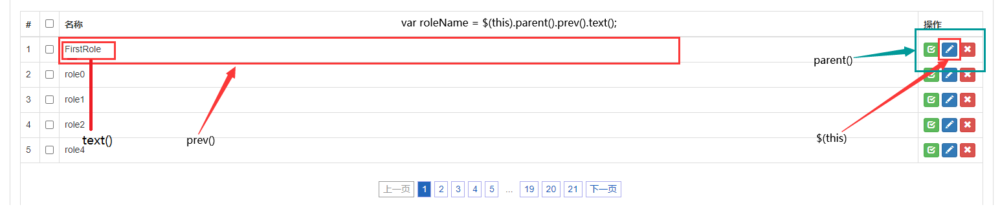
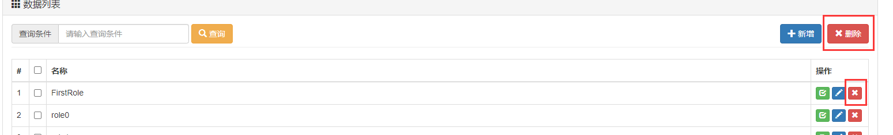

# 【角色维护】页面

## 一、分页操作

### 目标

将角色数据进行分页显示

### 思路

点击后台主页面的权限管理->角色维护，通过view-controller进入角色分页显示的页面，浏览器加载页面的数据并初始化一些数据（页码、页大小、关键词等），调用分页函数与后端交互进行分页操作，得到分页后的页面，并生成页码导航条，且可通过关键词来匹配角色。

与管理员维护部分不同的是，这里与后端交互，都通过json格式接收信息，而不通过直接的页面。

### 代码

1、创建数据库表：

```sql
#使用project_rowd数据库
use project_rowd;

#创建t_role表
CREATE TABLE t_role(
	id INT NOT NULL,
	name char(100),
	PRIMARY KEY(id)
);

#设置id自增
ALTER TABLE t_role CHANGE id id INT NOT NULL auto_increment;
```

​	

2、逆向生成资源

​		①修改generatorConfig代码：改为t_role表与Role实体类对应

```xml
<!-- 数据库表名与需要的实体类对应映射的指定 -->
<table tableName="t_role" domainObjectName="Role"/>
```

​		②通过maven中的工具，执行逆向工程，并把生成的内容都移动到正确的位置。


3、编写包含关键字的SQL查询语句

​		RoleMapper.xml

```xml
<!--查询所有匹配的role信息，用于分页显示-->
<select id="selectRoleByKeyword" resultMap="BaseResultMap">
  select id,name
  from t_role
  where
  name like CONCAT("%",#{keyword},"%")
</select>
```


4、后端代码

​		RoleMapper.java

```java
List<Role> selectRoleByKeyword(String keyword);
```

​		RoleServiceImpl.java

```java
@Autowired
RoleMapper roleMapper;

// 获取分页的用户列表
@Override
public PageInfo<Role> getPageInfo(int pageNum, int pageSize, String keyword) {
    // 开启分页
    PageHelper.startPage(pageNum,pageSize);

    // 从mapper方法得到Role的List
    List<Role> roles = roleMapper.selectRoleByKeyword(keyword);

    // 封装为PageInfo对象
    PageInfo<Role> pageInfo = new PageInfo<Role>(roles);

    // 返回pageInfo
    return pageInfo;
}
```

​		RoleHandler.java

```java
// 以json形式显示分页后的role信息
@ResponseBody
@RequestMapping("/role/page/page.json")
public ResultEntity<PageInfo<Role>> getPageInfo(
        @RequestParam(value = "pageNum", defaultValue = "1") Integer pageNum,
        @RequestParam(value = "pageSize", defaultValue = "5") Integer pageSize,
        @RequestParam(value = "keyword", defaultValue = "") String keyword ) {
    // 从Service层得到pageInfo
    PageInfo<Role> pageInfo = roleService.getPageInfo(pageNum, pageSize, keyword);

    // 返回ResultEntity，Data就是得到的pageInfo
    return ResultEntity.successWithData(pageInfo);
}
```

5、前端代码

​		通过view-controller使点击后台主页面的对应按钮时可以跳转到用户维护页面

​		在被提取出来的include-sidebar.jsp中：

```html
<li style="height:30px;">
    <a href="role/to/page.html"><i class="glyphicon glyphicon-king"></i> 角色维护</a>
</li>
```

​		将对应路径加载mvc配置文件中

```xml
<!-- 前往角色维护页面 -->
<mvc:view-controller path="/role/to/page.html" view-name="role-page"/>
```

​		创建显示分页内容的页面——role-page.jsp

​		大体的结构与前面admin-page.jsp类似。

​		在该部分中，分页、页码导航条的内容，提取到外部js文件的各个方法中来实现：

​		**my-role.js**

```javascript
// 执行分页，生成分页效果
function generatePage(){
    // 通过getPageInfoRemote()方法得到pageInfo
    var pageInfo = getPageInfoRemote();
    
	// 将pageInfo传入fillTableTBody()方法，在tbody中生成分页后的数据
    fillTableTBody(pageInfo);
}

// 从远程服务器端获取PageInfo数据
function getPageInfoRemote(){

    // 调用$.ajax()函数发送请求，并用ajaxResult接收函数返回值
    var ajaxResult = $.ajax({
        url:"role/page/page.json",
        type:"post",
        // 页码、页大小、关键字均从全局变量中获取
        data:{
            "pageNum":window.pageNum,
            "pageSize":window.pageSize,
            "keyword":window.keyword
        },
        async:false,        //关闭异步模式，使用同步，这是为了显示页面时保持现有的顺序
        dataType:"json"
    });

    // 取得当前的响应状态码
    var statusCode = ajaxResult.status;

    // 判断当前状态码是不是200，不是200表示发生错误，通过layer提示错误消息
    if(statusCode != 200) {
        layer.msg("失败！状态码=" + statusCode + "错误信息=" + ajaxResult.statusText);
        return null;
    }

    // 响应状态码为200，进入下面的代码
    // 通过responseJSON取得handler中的返回值
    var resultEntity = ajaxResult.responseJSON;

    // 从resultEntity取得result属性
    var result = resultEntity.result;

    // 判断result是否是FAILED
    if (result == "FAILED") {
        // 显示失败的信息
        layer.msg(resultEntity.message);
        return null;
    }

    // result不是失败时，获取pageInfo
    var pageInfo = resultEntity.data;

    // 返回pageInfo
    return pageInfo;
}

// 根据PageInfo填充表格
function fillTableTBody(pageInfo){

    // 清除tbody中的旧内容
    $("#rolePageTBody").empty();

    // 使无查询结果时，不显示导航条
    $("#Pagination").empty();

    // 判断pageInfo对象是否有效，无效则表示未查到数据
    if (pageInfo == null || pageInfo == undefined || pageInfo.list == null || pageInfo.list.length == 0) {
        $("#rolePageTBody").append("<tr><td colspan='4' align='center'>抱歉！没有查询到想要的数据</td></tr>");
        return;
    }

    // pageInfo有效，使用pageInfo的list填充tbody
    for (var i = 0; i < pageInfo.list.length; i++) {

        var role = pageInfo.list[i];
        var roleId = role.id;
        var roleName = role.name;
        var numberTd = "<td>"+(i+1)+"</td>";
        var checkboxTd = "<td><input type='checkbox'/></td>";
        var roleNameTd = "<td>" + roleName + "</td>";

        var checkBtn = "<button type='button' class='btn btn-success btn-xs'><i class=' glyphicon glyphicon-check'></i></button>"

        var pencilBtn = "<button type='button' class='btn btn-primary btn-xs'><i class=' glyphicon glyphicon-pencil'></i></button>"

        var removeBtn = "<button type='button' class='btn btn-danger btn-xs'><i class=' glyphicon glyphicon-remove'></i></button>"

        // 拼接三个小按钮成一个td
        var buttonTd = "<td>"+checkBtn + " " + pencilBtn + " " + removeBtn + "</td>";
        
        // 将所有的td拼接成tr
        var tr = "<tr>" + numberTd + checkboxTd + roleNameTd + buttonTd + "</tr>";

        // 将拼接后的结果，放入id=rolePageTBody
        $("#rolePageTBody").append(tr);
    }

    // 调用generateNavigator()方法传入pageInfo，进行生成分页页码导航条
    generateNavigator(pageInfo);

}

// 生成分页页码导航条
function generateNavigator(pageInfo){


    //获取分页数据中的总记录数
    var totalRecord = pageInfo.total;

    //声明Pagination设置属性的JSON对象
    var properties = {
        num_edge_entries: 3,                                //边缘页数
        num_display_entries: 5,                             //主体页数
        callback: paginationCallback,                       //点击各种翻页反扭时触发的回调函数（执行翻页操作）
        current_page: (pageInfo.pageNum-1),                 //当前页码
        prev_text: "上一页",                                 //在对应上一页操作的按钮上的文本
        next_text: "下一页",                                 //在对应下一页操作的按钮上的文本
        items_per_page: pageInfo.pageSize   				//每页显示的数量
    };

    // 调用pagination()函数，生成导航条
    $("#Pagination").pagination(totalRecord,properties);


}

// 翻页时的回调函数
function paginationCallback(pageIndex, jQuery){

    // pageIndex是当前页码的索引，因此比pageNum小1
    window.pageNum = pageIndex+1;

    // 重新执行分页代码
    generatePage();

    // 取消当前超链接的默认行为
    return false;

}
```

​		编写role-page.jsp页面，进行引入外部js、调用js中的函数等操作

```jsp
<%--引入pagination的css--%>
<link href="css/pagination.css" rel="stylesheet" />
<%--引入基于jquery的paginationjs--%>
<script type="text/javascript" src="jquery/jquery.pagination.js"></script>
<script type="text/javascript" src="crowd/my-role.js" charset="UTF-8"></script>
<script type="text/javascript">
    $(function (){
        // 设置各个全局变量，方便外部js文件中使用
        window.pageNum = 1;
        window.pageSize = 5;
        window.keyword = "";
        // 调用外部的生成分页的函数
        generatePage();
    }
</script>

	...中间代码省略
    <div class="table-responsive">
        <table class="table  table-bordered">
            <thead>
            <tr>
                <th width="30">#</th>
                <th width="30"><input type="checkbox"></th>
                <th>名称</th>
                <th width="100">操作</th>
            </tr>
            </thead>
            <%--  tbody的id=rolePageTBody,用于绑定on()函数 --%>
            <tbody id="rolePageTBody">
            </tbody>
            <tfoot>
            <tr>
                <td colspan="6" align="center">
                    <div id="Pagination" class="pagination"><!-- 这里显示分页导航条 --></div>
                </td>
            </tr>
            </tfoot>
        </table>
    </div>
	...中间代码省略
```

​	至此分页功能已经实现。


## 二、关键字查询

### 	目标

​			只需要将页面上的查询对应表单和已经封装好的分页函数对接即可。

### 	思路

​			从文本框获得关键字，给查询按钮绑定单击函数，将得到的关键字放入全局变量keyword中，再重新执行generatePage()函数。

### 	代码

​			查询操作的表单中给input、按钮设置id：

```jsp
<form class="form-inline" role="form" style="float:left;">
    <div class="form-group has-feedback">
        <div class="input-group">
            <div class="input-group-addon">查询条件</div>
            <input class="form-control has-success" id="inputKeyword" type="text" placeholder="请输入查询条件">
        </div>
    </div>
    <button id="searchBtn" type="button" class="btn btn-warning"><i class="glyphicon glyphicon-search"></i> 查询
    </button>
</form>
```

​		给查询按钮绑定单击函数：

```javascript
$(function (){
    // 给查询按钮绑定单击响应函数
    $("#searchBtn").click(function (){
        // 设置全局变量的keyword为id=inputKeyword的元素中的内容
        window.keyword = $("#inputKeyword").val();
        // 将页码归为1
        window.pageNum = 1;
        // 重新执行分页操作
        generatePage();
    });
}
```


## 三、保存角色

### 	目标

​		点击新增的按钮后，打开一个模态框，在其中输入新角色信息，点击保存完成操作。

### 	思路

​		给新增按钮绑定单击响应函数，用于打开模态框，模态框中点击保存后，获取输入的信息，将其中信息通过Ajax请求的方式发送给后端，然后关闭模态框，显示操作结果，清理模态框中的文字，重新加载分页。

### 	代码

​		①新建一个JSP文件，用于存放用于添加的模态框窗口代码（modal-role-add.jsp）：

```jsp
<%@ page contentType="text/html;charset=UTF-8" language="java" pageEncoding="UTF-8" %>
<div id="addRoleModal" class="modal fade" tabindex="-1" role="dialog">
    <div  class="modal-dialog" role="document">
        <div class="modal-content">
            <div class="modal-header">
                <button type="button" class="close" data-dismiss="modal" aria-label="Close"><span aria-hidden="true">&times;</span></button>
                <h4 class="modal-title">尚筹网-角色添加</h4>
            </div>
            <div class="modal-body">
                <form class="form-signin" role="form">
                    <div class="form-group has-success has-feedback">
                        <input type="text" name="roleName" class="form-control" id="inputSuccess4" placeholder="请输入角色名称" autofocus>
                        <span class="glyphicon glyphicon-user form-control-feedback"></span>
                    </div>
                </form>
            </div>
            <div class="modal-footer">
                <button id="saveRoleBtn" type="button" class="btn btn-primary">保存</button>
            </div>
        </div>
    </div>
</div>
```

​		②在分页显示的页面引入模态框（放在body标签的末尾）

```jsp
<%@include file="/WEB-INF/modal-role-add.jsp"%>
```

​		③给新增按钮绑定单击响应函数，用于打开模态框

```jsp
// 单击添加按钮，打开添加角色的模态框（这段js代码位于jsp文件的$(function())中）
	$("#showAddModalBtn").click(function () {
	$("#addRoleModal").modal("show");
});

<%-- body标签中的新增按钮 --%>
<button type="button" class="btn btn-primary" 
        style="float:right;" id="showAddModalBtn">
    <i class="glyphicon glyphicon-plus"></i> 新增
</button>
```

​		④点击模态框中的保存按钮后，触发的事件（直接写在jsp中）：

```javascript
// 单击模态框中的保存按钮，给后端发送要保存的数据
$("#saveRoleBtn").click(function () {
    // 获取id为addRoleModal的子元素中name为"roleName"的元素的内容，并去空格(trim)
    var roleName = $.trim($("#addRoleModal [name=roleName]").val());

    $.ajax({
        url:"role/do/save.json",
        type:"post",
        data:{
          "name":roleName
        },
        dataType:"json",
        success:function (response) {
            // 返回的result为SUCCESS
            if (response.result == "SUCCESS"){
                layer.msg("操作成功！");
                // 进入最后一页 方便显示添加的内容
                window.pageNum = 999;
                // 重新生成分页
                generatePage();
            }
            // 返回的result为FAILED
            if (response.result == "FAILED")
                layer.msg("操作失败"+response.message)
        },
        error:function (response) {
            layer.msg("statusCode="+response.status + " message="+response.statusText);
        }

    });

    // 关闭模态框
    $("#addRoleModal").modal("hide");

    // 清理模态框文本框
    $("#addRoleModal [name=roleName]").val("");

});
```

​		⑤后端controller代码：

```java
@ResponseBody
@RequestMapping("/role/do/save.json")
public ResultEntity<String> saveRole(Role role){
    roleService.saveRole(role);

    return ResultEntity.successWithoutData();
}
```

​		⑥Service层代码：

```java
@Override
public void saveRole(Role role) {
    roleMapper.insert(role);
}
```

​		

​		此时角色添加功能已经实现。因为数据库中设置了id为自增，因此只需要传入一个角色名，就可以通过Role对象接收，之后由数据库自动加上角色的id。


## 四、更新角色

### 	目标

​		通过每一个角色的“铅笔”按钮，修改角色信息。

### 	思路

​		给铅笔按钮绑定单击响应函数，打开修改角色的模态框，且角色名的文本框中回显当前角色的名称，通过点击模态框中的更新按钮，获取文本框中获取到的角色名，给后端发送Ajax请求，最后完成后关闭模态框，显示操作结果，重新加载分页。

### 	代码

​		①修改角色页面的模态框（modal-role-update.jsp）

```jsp
<%@ page contentType="text/html;charset=UTF-8" language="java" pageEncoding="UTF-8" %>
<div id="updateRoleModal" class="modal fade" tabindex="-1" role="dialog">
    <div  class="modal-dialog" role="document">
        <div class="modal-content">
            <div class="modal-header">
                <button type="button" class="close" data-dismiss="modal" aria-label="Close"><span aria-hidden="true">&times;</span></button>
                <h4 class="modal-title">尚筹网-角色更新</h4>
            </div>
            <div class="modal-body">
                <form class="form-signin" role="form">
                    <div class="form-group has-success has-feedback">
                        <input type="text" name="roleName" class="form-control" id="inputSuccess4" placeholder="请输入角色名称" autofocus>
                        <span class="glyphicon glyphicon-user form-control-feedback"></span>
                    </div>
                </form>
            </div>
            <div class="modal-footer">
                <button id="updateRoleBtn" type="button" class="btn btn-success">更新</button>
            </div>
        </div>
    </div>
</div>
```

​		②JSP页面引入模态框

```jsp
<%@include file="/WEB-INF/modal-role-update.jsp"%>
```

​		

​		修改外部js中生成代码中生成铅笔按钮时，给其添加id与class（id为当前角色的id，class统一为pencilBtn）

```javascript
// 铅笔按钮用于修改role信息。用id属性（也可以是其他属性）携带当前的角色的id，class添加一个pencilBtn，方便添加响应函数
var pencilBtn = 
    "<button type='button' id='"+roleId+"' class='btn btn-primary btn-xs pencilBtn'><i class=' glyphicon glyphicon-pencil'></i></button>"
```


​		③给每一个铅笔按钮绑定单击函数（写在role-page.jsp文件中）

​		因为这些按钮都通过动态生成，且翻页时Ajax形式的，因此不能简单的通过$("xxx").click()实现绑定单击函数（这样绑定在翻页后就		实失效了），而是需要使用jquery的on函数来绑定。

```javascript
// 给铅笔按钮绑定单击响应函数
// 注意，如果这里使用简单的$(".pencilBtn").click();来绑定，会发现只在初始页生效，当进入其他页码时，按钮失效
// 因此，这里使用jQuery的on()函数解决上面的问题
// on()函数三个传参：1、事件名 ; 2、真正要绑定的按钮的选择器 ; 3、绑定的函数
$("#rolePageTBody").on("click",".pencilBtn",function () {

    // 打开模态框
    $("#updateRoleModal").modal("show");

    // 获取表格中当前行的roleName（通过找父元素的前一个兄弟元素）
    var roleName = $(this).parent().prev().text();

    // 根据pencilBtn的id获得角色id
    // 存放在全局变量中，为了让执行更新操作的按钮可以获取到roleId
    window.roleId = this.id;

    // 将得到的roleName填充到模态框中（id=updateRoleModal的元素的后代元素，且name=roleName的文本框）
    $("#updateRoleModal [name=roleName]").val(roleName);

});
```

roleName的定位过程：



​		④给模态框中的修改按钮绑定单击函数

```javascript
// 给更新模态框中的更新按钮绑定单击响应函数
$("#updateRoleBtn").click(function () {

    // 从模态框的文本框中获得修改后的roleName
    var roleName = $("#updateRoleModal [name=roleName]").val();

    $.ajax({
        url: "role/do/update.json",
        type: "post",
        data: {
            "id":window.roleId,	// 从全局遍历取得当前角色的id
            "name":roleName
        },
        dataType: "json",
        success:function (response) {
            if (response.result == "SUCCESS"){
                layer.msg("操作成功！");
                generatePage();
            }
            if (response.result == "FAILED")
                layer.msg("操作失败"+response.message)
        },
        error:function (response) {
            layer.msg("statusCode="+response.status + " message="+response.statusText);
        }
    });

    // 关闭模态框
    $("#updateRoleModal").modal("hide");
    // 由于铅笔按钮每次都会向文本框填充被更新角色的原始数据，因此不需要情况文本框
});
```

​		⑤编写后端代码：

​		Controller层：

```java
@ResponseBody
@RequestMapping("/role/do/update.json")
public ResultEntity<String> updateRole(Role role){
    roleService.updateRole(role);
    return ResultEntity.successWithoutData();
}
```

​		Service层：

```java
@Override
public void updateRole(Role role) {
    // 通过主键（id）修改角色名
    roleMapper.updateByPrimaryKey(role);
}
```


## 五、删除角色

### 目标

​	实现多角色同时删除以及单条角色快速删除

### 思路

​	单击每一个角色对应的红色**X**按钮，或通过多选框选中要删除的角色后，点击页面右上方的删除按钮，弹出模态框询问是否确认删除，并显示被选中的角色名称，点击确认删除后，删除对应的角色



​	给删除按钮与X按钮绑定单击函数，弹出删除确认模态框，给模态框中的确认删除绑定单击函数，点击后发送给后端执行删除操作。

### 代码

​	①确认删除模态框（modal-role-confirm.jsp）

```jsp
<%@ page contentType="text/html;charset=UTF-8" language="java" pageEncoding="UTF-8" %>
<div id="confirmRoleModal" class="modal fade" tabindex="-1" role="dialog">
    <div  class="modal-dialog" role="document">
        <div class="modal-content">
            <div class="modal-header">
                <button type="button" class="close" data-dismiss="modal" aria-label="Close"><span aria-hidden="true">&times;</span></button>
                <h4 class="modal-title">尚筹网-确认删除</h4>
            </div>

            <div class="modal-body">
                <h4>请确认是否删除下列角色！</h4>
                <%-- 确认的列表 --%>
                <div id="confirmList" style="text-align: center"></div>
            </div>
            <div class="modal-footer">
                <button id="confirmRoleBtn" type="button" class="btn btn-success">确认删除</button>
            </div>
        </div>
    </div>
</div>
```

​	②引入模态框

```jsp
<%@include file="/WEB-INF/modal-role-confirm.jsp"%>
```

​	③先编写多选删除与单选删除统一对应的删除后端代码：

​		Controller层：

```java
@ResponseBody
@RequestMapping("/role/do/remove.json")
public ResultEntity<String> removeRole(@RequestBody List<Integer> roleIdArray){

    // service层方法通过id的List删除角色
    roleService.removeById(roleIdArray);
    
    return ResultEntity.successWithoutData();

}
```

​		Service层：

```java
@Override
public void removeById(List<Integer> roleIdList) {
    // 创建RoleExample
    RoleExample roleExample = new RoleExample();

    // 获取Criteria对象
    RoleExample.Criteria criteria = roleExample.createCriteria();

    // 使用Criteria封装查询条件为id的List
    criteria.andIdIn(roleIdList);

    // mapper执行删除操作
    roleMapper.deleteByExample(roleExample);
}
```

​	④编写打开确认删除模态框的函数：（被调用时使用，写在外部js文件my-role.js）

```javascript
// 打开确认删除的模态框
function showConfirmModal(roleArray){
    // 显示模态框
    $("#confirmRoleModal").modal("show");

    // 清除旧的模态框中的数据
    $("#confirmList").empty();

    // 创建一个全局变量数组，用于存放要删除的roleId
    window.roleIdArray = [];

    // 填充数据
    for (var i = 0; i < roleArray.length; i++){

        var roleId = roleArray[i].id;

        // 将当前遍历到的roleId放入全局变量
        window.roleIdArray.push(roleId);

        var roleName = roleArray[i].name;

        $("#confirmList").append(roleName+"<br/>");
    }

}
```

​	

​	⑤为模态框中的确认删除按钮绑定单击事件（写在原本的role-page.jsp中）

```javascript
// 为 “确认删除” 按钮绑定单击事件
$("#confirmRoleBtn").click(function () {
	// 将全局变量中的id数组转换为json字符串格式
    var arrayStr = JSON.stringify(window.roleIdArray);

    $.ajax({
        url: "role/do/remove.json",
        type: "post",
        data: arrayStr,									// 将转换后的数据传给后端
        dataType: "json",
        contentType: "application/json;charset=UTF-8",	// 表明发送json格式数据
        success:function (response) {
            if (response.result == "SUCCESS"){
                layer.msg("操作成功！");
                generatePage();
            }
            if (response.result == "FAILED")
                layer.msg("操作失败"+response.message)
        },
        error:function (response) {
            layer.msg("statusCode="+response.status + " message="+response.statusText);
        }
    });

    // 关闭模态框
    $("#confirmRoleModal").modal("hide");
});
```


​	在外部js文件给X按钮设置id与class（id为角色id，class统一为removeBtn）

```javascript
var removeBtn = "<button type='button' id='"+roleId+"' class='btn btn-danger btn-xs removeBtn'><i class=' glyphicon glyphicon-remove'></i></button>"
```


​	⑥先编写单条删除的代码

```javascript
// 给单条删除按钮绑定单击事件
$("#rolePageTBody").on("click",".removeBtn",function () {
    
	// 通过X按钮删除时，只有一个角色，因此只需要建一个特殊的数组，存放单个对象即可
    var roleArray = [{
        "id": this.id,
        "name": $(this).parent().prev().text()
    }]

    // 调用显示模态框函数，传入roleArray
    showConfirmModal(roleArray);

});
```

​	⑦多选框的操作完善（全选、全不选等）

​		在外部js文件的生成表单的代码中给选择框加id与class（id=当前角色的id，class统一为itemBox）

```javascript
var checkboxTd = "<td><input type='checkbox' id='"+roleId+"' class='itemBox'/></td>";
```

​		给全选框设置id（id=summaryBox）

```jsp
<thead>
<tr>
    <th width="30">#</th>
    <th width="30"><input id="summaryBox" type="checkbox"></th>
    <th>名称</th>
    <th width="100">操作</th>
</tr>
</thead>
```

​		完善全选全不选：


```javascript
// 单击全选框时，使下面的内容全选/全不选
$("#summaryBox").click(function () {
    // 获取当前状态（是否被选中）
    var currentStatus = this.checked;

    $(".itemBox").prop("checked",currentStatus);

});

// 由下面的选择框，改变全选框的勾选状态
$("#rolePageTBody").on("click",".itemBox",function () {

    // 获取当前已被选中的itemBox的数量
    var checkedBoxCount = $(".itemBox:checked").length;
    // 获取当前的所有的itemBox数量
    var currentBoxCount = $(".itemBox").length;

    $("#summaryBox").prop("checked",checkedBoxCount == currentBoxCount);
});
```

​	⑧给多选删除按钮绑定单击事件

```javascript
// 给多选删除按钮绑定单击事件
$("#batchRemoveBtn").click(function (){

    // 创建一个数组对象，用来存放后面获得的角色对象
    var roleArray = [];

    // 遍历被勾选的内容
    $(".itemBox:checked").each(function () {
        // 通过this引用当前遍历得到的多选框的id
        var roleId = this.id;

        // 通过DOM操作获取角色名称
        var roleName = $(this).parent().next().text();

        roleArray.push({
            "id":roleId,
            "name":roleName
        });
    });

    // 判断roleArray的长度是否为0
    if (roleArray.length == 0){
        layer.msg("请至少选择一个来删除");
        return ;
    }

    // 显示确认框
    showConfirmModal(roleArray);
});
```

​	角色删除功能至此完成。


​	角色维护部分的代码也全部完成。