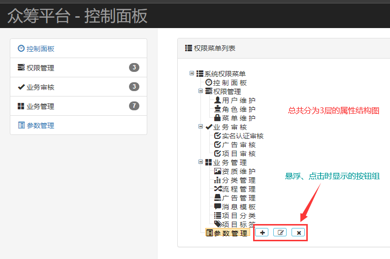
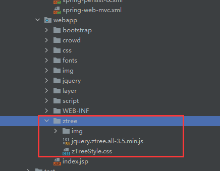

# 【菜单维护】页面

在【菜单维护】页面，通过树形结构，使用**zTree**显示整个菜单。




## 准备工作


### 一、在数据库创建菜单表：

```sql
#使用project_rowd表
use project_rowd;

#创建菜单的数据库表
create table t_menu
(
	id int(11) not null auto_increment, 
	pid int(11), 
	name varchar(200), 
	url varchar(200),
	icon varchar(200), 
	primary key (id)
);

#插入数据
insert into `t_menu` (`id`, `pid`, `name`, `icon`, `url`) values('1',NULL,' 系统权限菜单','glyphicon glyphicon-th-list',NULL);
insert into `t_menu` (`id`, `pid`, `name`, `icon`, `url`) values('2','1',' 控 制 面 板 ','glyphicon glyphicon-dashboard','main.htm');
insert into `t_menu` (`id`, `pid`, `name`, `icon`, `url`) values('3','1','权限管理','glyphicon glyphicon glyphicon-tasks',NULL);
insert into `t_menu` (`id`, `pid`, `name`, `icon`, `url`) values('4','3',' 用 户 维 护 ','glyphicon glyphicon-user','user/index.htm');
insert into `t_menu` (`id`, `pid`, `name`, `icon`, `url`) values('5','3',' 角 色 维 护 ','glyphicon glyphicon-king','role/index.htm');
insert into `t_menu` (`id`, `pid`, `name`, `icon`, `url`) values('6','3',' 菜 单 维 护 ','glyphicon glyphicon-lock','permission/index.htm');
insert into `t_menu` (`id`, `pid`, `name`, `icon`, `url`) values('7','1',' 业 务 审 核 ','glyphicon glyphicon-ok',NULL);
insert into `t_menu` (`id`, `pid`, `name`, `icon`, `url`) values('8','7',' 实名认证审核','glyphicon glyphicon-check','auth_cert/index.htm');
insert into `t_menu` (`id`, `pid`, `name`, `icon`, `url`) values('9','7',' 广 告 审 核 ','glyphicon glyphicon-check','auth_adv/index.htm');
insert into `t_menu` (`id`, `pid`, `name`, `icon`, `url`) values('10','7',' 项 目 审 核 ','glyphicon glyphicon-check','auth_project/index.htm');
insert into `t_menu` (`id`, `pid`, `name`, `icon`, `url`) values('11','1',' 业 务 管 理 ','glyphicon glyphicon-th-large',NULL);
insert into `t_menu` (`id`, `pid`, `name`, `icon`, `url`) values('12','11',' 资 质 维 护 ','glyphicon glyphicon-picture','cert/index.htm');
insert into `t_menu` (`id`, `pid`, `name`, `icon`, `url`) values('13','11',' 分 类 管 理 ','glyphicon glyphicon-equalizer','certtype/index.htm');
insert into `t_menu` (`id`, `pid`, `name`, `icon`, `url`) values('14','11',' 流 程 管 理 ','glyphicon glyphicon-random','process/index.htm');
insert into `t_menu` (`id`, `pid`, `name`, `icon`, `url`) values('15','11',' 广 告 管 理 ','glyphicon glyphicon-hdd','advert/index.htm');
insert into `t_menu` (`id`, `pid`, `name`, `icon`, `url`) values('16','11',' 消 息 模 板 ','glyphicon glyphicon-comment','message/index.htm');
insert into `t_menu` (`id`, `pid`, `name`, `icon`, `url`) values('17','11',' 项 目 分 类 ','glyphicon glyphicon-list','projectType/index.htm');
insert into `t_menu` (`id`, `pid`, `name`, `icon`, `url`) values('18','11',' 项 目 标 签 ','glyphicon glyphicon-tags','tag/index.htm');
insert into `t_menu` (`id`, `pid`, `name`, `icon`, `url`) values('19','1',' 参 数 管 理 ','glyphicon glyphicon-list-alt','param/index.htm');
```

数据库中，节点与父节点通过pid关联，节点的pid就是其父节点的id；若pid=null，则表示该节点为根节点


### 二、逆向工程

逆向生成实体类、mapper文件等

```xml
<!-- 数据库表名与需要的实体类对应映射的指定 -->
<table tableName="t_menu" domainObjectName="Menu"/>
```

创建Service层接口与实现类、Controller层。

**MenuService**、**MenuServiceImpl**、**MenuHandler**

为了在页面上获取方便，给Menu实体类增加两个变量，并设置Get、Set方法：

```java
// 子节点的集合，初始化时为了避免空指针异常
private List<Menu> children = new ArrayList<>();
// 控制节点默认是否为打开状态，设置为true表示默认打开
private Boolean open = true;
```


## 在页面显示树形结构

### 一、后端操作

​	在Java代码中把查询到的表单数据组合成一棵树

Controller：

```java
@ResponseBody
@RequestMapping("/menu/do/get.json")
public ResultEntity<Menu> getWholeTree(){
    // 通过service层方法得到全部Menu对象的List
    List<Menu> menuList = menuService.getAll();

    // 声明一个Menu对象root，用来存放找到的根节点
    Menu root = null;

    // 使用map表示每一个菜单与id的对应关系
    Map<Integer,Menu> menuMap = new HashMap<>();

    // 将菜单id与菜单对象以K-V对模式存入map
    for(Menu menu: menuList){
        menuMap.put(menu.getId(),menu);
    }

    for (Menu menu : menuList){
        Integer pid = menu.getPid();

        if (pid == null){
            // pid为null表示该menu是根节点
            root = menu;
            continue;
        }
        // 通过当前遍历的menu的pid得到其父节点
        Menu father = menuMap.get(pid);
        // 为父节点添加子节点为当前节点
        father.getChildren().add(menu);
    }
    
	// 将根节点作为data返回（返回根节点也就返回了整棵树）
    return ResultEntity.successWithData(root);
}
```

Service层：

```java
@Override
public List<Menu> getAll() {
    // 直接传入一个new出来的Example，也就查询了整个表的数据
    return menuMapper.selectByExample(new MenuExample());
}
```


### 二、前端操作

通过view-controller设置跳转：

```xml
    <!-- 前往菜单维护页面 -->
<mvc:view-controller path="/menu/to/page.html" view-name="menu-page"/>
```

之后在sidebar的页面，将对应【菜单维护】的链接设置成menu/to/page.html


需要使用zTree，因此要引入zTree的文件：




创建menu-page.jsp页面：

这里给出的时main div中的内容

```jsp
<div class="col-sm-9 col-sm-offset-3 col-md-10 col-md-offset-2 main">
    <div class="panel panel-default">
        <div class="panel-heading"><i class="glyphicon glyphicon-th-list"></i> 权限菜单列表 
            <div style="float:right;cursor:pointer;" data-toggle="modal" data-target="#myModal">
                <i class="glyphicon glyphicon-question-sign">
                </i>
            </div>
        </div>
        <div class="panel-body">
            <ul id="treeDemo" class="ztree">
				<%-- 显示树形结构依附于上面的ul --%>
            </ul>
        </div>
    </div>
</div>
```

并且在头部引入zTree的文件：

```jsp
<link rel="stylesheet" href="ztree/zTreeStyle.css"/>
<script type="text/javascript" src="ztree/jquery.ztree.all-3.5.min.js"></script>
```


则在前端显示树形结构的代码：

​	将生成树形结构等代码提取到外部js文件**my-menu.js**

```javascript
// 封装生成树形结构的代码
function generateTree(){
    $.ajax({
        url:"menu/do/get.json",
        type:"post",
        dataType:"json",
        success:function (response) {
            if (response.result == "SUCCESS"){
                // 成功 则设置下列属性
                var setting = {
                    view:{
                        // 设置每一个标签的图标
                        "addDiyDom":myAddDiyDom,
                        // 设置悬浮在标签上时的函数
                        "addHoverDom":myAddHoverDom,
                        // 设置从标签上移除时的函数
                        "removeHoverDom":myRemoveHoverDom
                    },
                    data:{
                        key:{
                            // 实现“点了不跑”，也就是设置了这里的url后，会根据该url去寻找页面，如果页面找不到，则不跳转
                            /*
                           	 	zTree 节点数据保存节点链接的目标 URL 的属性名称。
                            	特殊用途：当后台数据只能生成 url 属性，又不想实现点击节点跳转的功能时，可以直接修改此属性为其他不存在的属性名称
                                默认值："url"
                            */
                            url: "NotExist"
                        }
                    }
                };
                // 通过response得到data，就是后端传来的查询结构
                var zNodes = response.data;
                // 执行zTree的初始化函数，传参分别是依附的ul的id（通过jQuery选择器）、setting变量、查询到的树形结构
                $.fn.zTree.init($("#treeDemo"), setting, zNodes);
            }
            if (response.result == "FAILED")
                layer.msg("操作失败"+response.message)
        },
        error:function (response) {
            layer.msg("statusCode="+response.status + " message="+response.statusText);
        }
    });
}
```

而对应放在setting的view中的三个函数：

```javascript
function myAddDiyDom(treeId, treeNode) {
    // treeId就是树形结构依附的ul的id
    // treeNode就是当前节点全部数据（包括后端查询得到的）

    // 根据zTree中每一个图标span的id的规则：
    // 如treeDemo_7_ico
    // id结构就是ul的id_当前节点序号_ico（tId就是id_当前节点序号）
    // 可以拼出每一个span的id：
    var spanId = treeNode.tId + "_ico";
    // 删除旧的class，增加新得到的class
    $("#"+spanId).removeClass().addClass(treeNode.icon);
}

// 鼠标覆盖时，显示按钮组
function myAddHoverDom(treeId, treeNode) {
    // 定义增加、修改、删除节点的标签字符串
    var addBtn = "<a id='"+treeNode.id+"' class='addBtn btn btn-info dropdown-toggle btn-xs' style='margin-left:10px;padding-top:0px;' href='#' title='增加节点'>&nbsp;&nbsp;<i class='fa fa-fw fa-plus rbg '></i></a>";
    var editBtn = "<a id='"+treeNode.id+"' class='editBtn btn btn-info dropdown-toggle btn-xs' style='margin-left:10px;padding-top:0px;' href='#' title='修改节点'>&nbsp;&nbsp;<i class='fa fa-fw fa-edit rbg '></i></a>";
    var removeBtn = "<a id='"+treeNode.id+"' class='removeBtn btn btn-info dropdown-toggle btn-xs' style='margin-left:10px;padding-top:0px;' href='#' title='删除节点'>&nbsp;&nbsp;<i class='fa fa-fw fa-times rbg '></i></a>";

    // btn用于存放不同的节点显示的不同的按钮
    var btn = "";

    // 得到每个节点的level，根据level决定显示的按钮组的内容
    var level = treeNode.level;

    // 按照一定规则设置按钮组span的id
    var btnGroupId = "btnGroupTreeDemo_"+treeNode.id;

    // 如果此时按钮组已经有内容了，则不再往下执行
    if ($("#"+btnGroupId).length > 0){
        return ;
    }

    // 根据level决定按钮组内部显示的内容
    if (level === 0){
        btn = addBtn;
    } else if (level === 1){
        btn = addBtn + editBtn;
        // 判断是否子节点，有子节点则不显示删除按钮，没有子节点则显示删除按钮
        if (treeNode.children.length === 0){
            btn = btn + removeBtn;
        }
    } else {
        // level==3则显示删除按钮与修改按钮
        btn = editBtn+removeBtn;
    }

    // 拼接a标签的id（treeDemo_x_a）
    var aId = treeNode.tId + "_a";

    // 根据id，在a标签后加按钮组
    $("#"+aId).after("<span id='"+btnGroupId+"'>"+btn+"</span>");

}

// 鼠标移开时，隐藏按钮组
function myRemoveHoverDom(treeId, treeNode) {
    // 按钮组span的id
    var btnGroupId = "btnGroupTreeDemo_"+treeNode.id;
    // 删除此id的标签
    $("#"+btnGroupId).remove();
}
```


## 【添加子节点】按钮

### **目标：**

实现给当前节点添加子节点，并保存到数据库中。

### **思路：**

点击“+”按钮，打开模态框，输入要保存的节点的名字，并选择图标后，点击保存，发送Ajax请求到后端，执行保存工作。

### **代码：**

#### 后端代码：

Controller：

```java
@ResponseBody
@RequestMapping("/menu/save.json")
public ResultEntity<String> saveMenu(Menu menu){

    menuService.saveMenu(menu);

    return ResultEntity.successWithoutData();
}
```

Service：

```java
@Override
public void saveMenu(Menu menu) {
    menuMapper.insert(menu);
}
```


#### 前端代码：

新增一个模态框页面**modal-menu-add.jsp**：

```jsp
<%@ page language="java" contentType="text/html;charset=UTF-8"
   pageEncoding="UTF-8"%>
<div id="menuAddModal" class="modal fade" tabindex="-1" role="dialog">
   <div class="modal-dialog" role="document">
      <div class="modal-content">
         <div class="modal-header">
            <button type="button" class="close" data-dismiss="modal"
               aria-label="Close">
               <span aria-hidden="true">&times;</span>
            </button>
            <h4 class="modal-title">尚筹网-添加节点</h4>
         </div>
         <form>
            <div class="modal-body">
               请输入节点名称：<input type="text" name="name" /><br />
               请输入URL地址：<input type="text" name="url" /><br />
               <i class="glyphicon glyphicon-th-list"></i>
               <input type="radio" name="icon" value="glyphicon glyphicon-th-list" />&nbsp;
               
               <i class="glyphicon glyphicon-dashboard"></i> 
               <input type="radio" name="icon" value="glyphicon glyphicon-dashboard" /> &nbsp;
               
               <i class="glyphicon glyphicon glyphicon-tasks"></i> 
               <input type="radio" name="icon" value="glyphicon glyphicon glyphicon-tasks" /> &nbsp;
               
               <i class="glyphicon glyphicon-user"></i> 
               <input type="radio" name="icon" value="glyphicon glyphicon-user" /> &nbsp;
               
               <i class="glyphicon glyphicon-king"></i> 
               <input type="radio" name="icon" value="glyphicon glyphicon-king" /> &nbsp;
               
               <i class="glyphicon glyphicon-lock"></i> 
               <input type="radio" name="icon" value="glyphicon glyphicon-lock" /> &nbsp;
               
               <i class="glyphicon glyphicon-ok"></i> 
               <input type="radio" name="icon" value="glyphicon glyphicon-ok" /> &nbsp;
               
               <i class="glyphicon glyphicon-check"></i> 
               <input type="radio" name="icon" value="glyphicon glyphicon-check" /> &nbsp;
               
               <i class="glyphicon glyphicon-th-large"></i>
               <input type="radio" name="icon" value="glyphicon glyphicon-th-large" /> <br /> 
               
               <i class="glyphicon glyphicon-picture"></i> 
               <input type="radio" name="icon" value="glyphicon glyphicon-picture" /> &nbsp;
               
               <i class="glyphicon glyphicon-equalizer"></i> 
               <input type="radio" name="icon" value="glyphicon glyphicon-equalizer" /> &nbsp;
               
               <i class="glyphicon glyphicon-random"></i> 
               <input type="radio" name="icon" value="glyphicon glyphicon-random" /> &nbsp;
               
               <i class="glyphicon glyphicon-hdd"></i> 
               <input type="radio" name="icon" value="glyphicon glyphicon-hdd" /> &nbsp;
               
               <i class="glyphicon glyphicon-comment"></i> 
               <input type="radio" name="icon" value="glyphicon glyphicon-comment" /> &nbsp;
               
               <i class="glyphicon glyphicon-list"></i> 
               <input type="radio" name="icon" value="glyphicon glyphicon-list" /> &nbsp;
               
               <i class="glyphicon glyphicon-tags"></i> 
               <input type="radio" name="icon" value="glyphicon glyphicon-tags" /> &nbsp;
               
               <i class="glyphicon glyphicon-list-alt"></i> 
               <input type="radio" name="icon" value="glyphicon glyphicon-list-alt" /> &nbsp;
               <br />
               
            </div>
            <div class="modal-footer">
               <button id="menuSaveBtn" type="button" class="btn btn-default">
                   <i class="glyphicon glyphicon-plus"></i> 保存</button>
               <button id="menuResetBtn" type="reset" class="btn btn-primary">
                   <i class="glyphicon glyphicon-refresh"></i> 重置</button>
            </div>
         </form>
      </div>
   </div>
</div>
```

在显示菜单结构的页面代码上引入模态框页面（这里将添加、修改、删除的页面都引入了，后面就不做多余的解释了）：

```jsp
<%@include file="/WEB-INF/modal-menu-add.jsp"%>
<%@include file="/WEB-INF/modal-menu-edit.jsp"%>
<%@include file="/WEB-INF/modal-menu-confirm.jsp"%>
```

给添加按钮添加单击函数：

```javascript
// 给“+”按钮，添加单击响应函数，打开添加节点的模态框
$("#treeDemo").on("click",".addBtn",function () {
	// 将当前按钮的id保存为全局变量pid，方便后面调用
    window.pid = this.id;
	// 打开模态框
    $("#menuAddModal").modal("show");
	// 关闭默认跳转行为
    return false;
});
```

打开模态框后，输入内容，点击的保存按钮的单击响应函数：

```javascript
// 添加节点模态框中保存按钮的单击事件
$("#menuSaveBtn").click(function () {
    // 从输入框中获得name，并去掉前后空格
    var name = $.trim($("#menuAddModal [name=name]").val());
	// 从输入框中获得url，并去掉前后空格
    var url = $.trim($("#menuAddModal [name=url]").val());
	// 下面的选项中获得被选中的icon的值
    var icon = $("#menuAddModal [name=icon]:checked").val();

    $.ajax({
        url:"menu/save.json",
        type:"post",
        "data":{
            "name":name,
            "url":url,
            "icon":icon,
            // 从全局变量获得该节点的父节点id
            "pid":window.pid
        },
        dataType:"json",
        success:function (response) {
            if(response.result == "SUCCESS"){
                layer.msg("操作成功！");

                // 重新生成树形结构
                generateTree();
            }
            if (response.result == "FAILED"){
                layer.msg("操作失败！");
            }
        },
        error:function (response) {
            layer.msg(response.status + " " + response.statusText);
        }

    });

    // 关闭模态框
    $("#menuAddModal").modal("hide");

    // 清空模态框内的数据(通过模拟用户单击“重置”按钮)
    $("#menuResetBtn").click();

});
```


## 【修改节点】按钮

### 目标：

修改当前选择节点的信息，但是不修改父节点

### 思路：

点击按钮组中的修改按钮，打开修改模态框，回显原本的name、url、icon数据，修改完成后点击模态框中的修改按钮，发送Ajax请求，后端完成在数据库进行修改。

### 代码：

#### 后端代码：

Controller：

```java
@ResponseBody
@RequestMapping("/menu/edit.json")
public ResultEntity<String> editMenu(Menu menu){
    menuService.editMenu(menu);
    return ResultEntity.successWithoutData();
}
```

Service：

```java
@Override
public void editMenu(Menu menu) {
    // 有选择地更新，如果menu中有的值为null（如这里的pid），则不会更新该内容
    menuMapper.updateByPrimaryKeySelective(menu);
}
```


#### 前端代码：

修改的模态框内容与添加模态框基本相同（此模态框的div的id为menuEditModal）

给修改按钮添加单击响应函数：

```javascript
// 动态生成的修改按钮，单击打开修改的模态框
$("#treeDemo").on("click",".editBtn",function () {

    // 保存此按钮的id
    window.id = this.id;

    $("#menuEditModal").modal("show");

    // 要实现通过id拿到整个节点的信息，需要拿到zTreeObj
    var zTreeObj = $.fn.zTree.getZTreeObj("treeDemo");

    var key = "id";
    var value = window.id;

    // getNodeByParam，通过id得到当前的整个节点
    // 注意：id为treeNode的id，返回的就是那个treeNode
    var currentNode = zTreeObj.getNodeByParam(key,value);

    $("#menuEditModal [name=name]").val(currentNode.name);

    $("#menuEditModal [name=url]").val(currentNode.url);
    // 这里currentNode.icon其实是数组形式，利用这个值，放在[]中，传回val，就可以使相匹配的值回显在模态框中
    $("#menuEditModal [name=icon]").val([currentNode.icon]);

    return false;
});
```

给模态框中的修改按钮添加单击响应函数：

```javascript
// 修改的模态框”修改按钮“的单击事件
$("#menuEditBtn").click(function () {
    var name = $.trim($("#menuEditModal [name=name]").val());

    var url = $.trim($("#menuEditModal [name=url]").val());

    var icon = $("#menuEditModal [name=icon]:checked").val();

    $.ajax({
        url:"menu/edit.json",
        type:"post",
        "data":{
            "id":window.id,
            "name":name,
            "url":url,
            "icon":icon
        },
        dataType:"json",
        success:function (response) {
            if(response.result == "SUCCESS"){
                layer.msg("操作成功！");

                // 重新生成树形结构
                generateTree();
            }
            if (response.result == "FAILED"){
                layer.msg("操作失败！");
            }
        },
        error:function (response) {
            layer.msg(response.status + " " + response.statusText);
        }

    });

    // 关闭模态框
    $("#menuEditModal").modal("hide");

});
```


## 【删除节点】按钮

### 目标：

点击删除按钮可以删除选中节点

### 思路：

给动态生成的按钮组中的删除按钮，添加单击响应函数，打开删除的确认模态框，模态框中显示图标+节点名字，点击确认删除后，给后端发送Ajax请求，由后端从服务器删除对应节点。

### 代码：

#### 后端代码：

Controller：

```java
@ResponseBody
@RequestMapping("/menu/remove.json")
public ResultEntity<String> removeMenu(Integer id){
    menuService.removeMenuById(id);
    return ResultEntity.successWithoutData();
}
```

Service：

```java
@Override
public void removeMenuById(Integer id) {
    menuMapper.deleteByPrimaryKey(id);
}
```


#### 前端代码：

模态框代码（modal-menu-confirm.jsp）：

```jsp
<%@ page language="java" contentType="text/html;charset=UTF-8"
   pageEncoding="UTF-8"%>
<div id="menuConfirmModal" class="modal fade" tabindex="-1" role="dialog">
   <div class="modal-dialog" role="document">
      <div class="modal-content">
         <div class="modal-header">
            <button type="button" class="close" data-dismiss="modal"
               aria-label="Close">
               <span aria-hidden="true">&times;</span>
            </button>
            <h4 class="modal-title">尚筹网系统弹窗</h4>
         </div>
         <form>
            <div class="modal-body">
               您真的要删除<span id="removeNodeSpan"></span>这个节点吗？
            </div>
            <div class="modal-footer">
               <button id="confirmBtn" type="button" class="btn btn-danger"><i class="glyphicon glyphicon-ok"></i>确认</button>
            </div>
         </form>
      </div>
   </div>
</div>
```

给动态生成的删除按钮绑定单击响应函数：

```javascript
// 动态生成的删除按钮的单击事件，（打开确认模态框）
$("#treeDemo").on("click",".removeBtn",function () {
    // 将当前的id放入全局变量
    window.id = this.id;
    
    // 打开模态框
    $("#menuConfirmModal").modal("show");

    // 拿到zTreeObject
    var zTreeObj = $.fn.zTree.getZTreeObj("treeDemo");

    var key = "id";
    var value = window.id;

    // 通过getNodeByParam()，传入当前节点的id，得到当前节点的对象
    var currentNode = zTreeObj.getNodeByParam(key, value);

    // 通过得到的节点对象得到该节点的name与icon
    var name = currentNode.name;
    var icon = currentNode.icon;

    // 回显-向id=removeNodeSpan的span标签添加html语句（显示图标与节点名）
    $("#removeNodeSpan").html("【<i class='"+icon+"'>"+name+"】</i>");

    // 关闭默认跳转
    return false;

});
```

给确认模态框中的确认删除按钮添加响应函数：

```javascript
    // 确认模态框中，“确认”按钮的单击事件（发送Ajax请求）
    $("#confirmBtn").click(function () {
        $.ajax({
            url:"menu/remove.json",
            type:"post",
            "data":{
                // 只传入一个id
                "id":window.id,
            },
            dataType:"json",
            success:function (response) {
                if(response.result == "SUCCESS"){
                    layer.msg("操作成功！");

                    // 重新生成树形结构
                    generateTree();
                }
                if (response.result == "FAILED"){
                    layer.msg("操作失败！");
                }
            },
            error:function (response) {
                layer.msg(response.status + " " + response.statusText);
            }
        });

        $("#menuConfirmModal").modal("hide");
    });

});
```


## 注意：

在**删除**、**添加**按钮中，直接通过this.id给全局的id赋值，传入到getNodeByParam()函数中得到节点对象，是因为在js中生成动态按钮的时候已经设置好了按钮的id就是当前treeNode的id，因此可以通过按钮的id来得到当前的treeNode（也就包含了当前节点的所有信息），再由treeNode得到如菜单的name、url、icon等。

