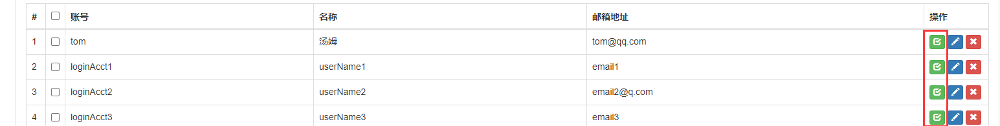
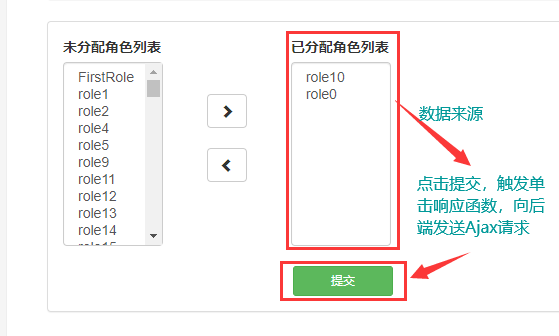
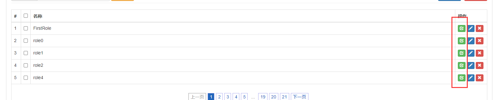
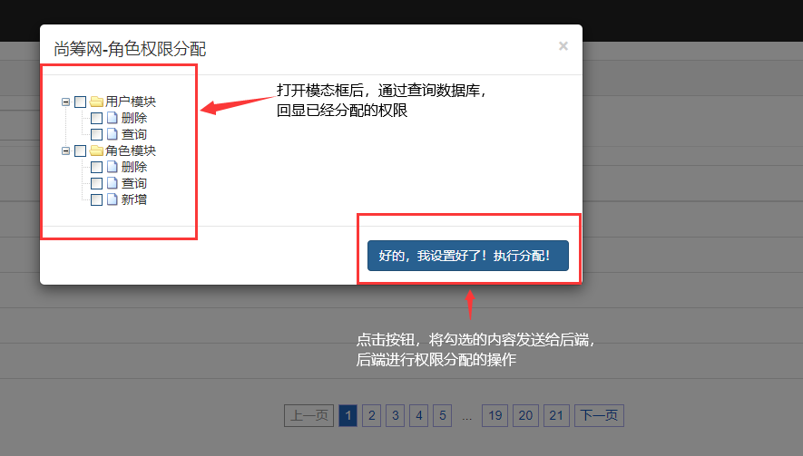

# 权限分配

在实现权限控制之前，这里先完成给Admin分配Role和给Role分配Auth的功能。

## 一、给Admin分配Role

### 目标

​	通过前端页面操作，将Admin与Role之间的关系保存到数据库

### 思路

​	给下面的按钮，添加单击响应函数



打开如下页面：



通过左右按钮，可以改变角色分配的情况。


### 代码

#### 1）、创建关联数据库表

​		**inner_admin_role**

```sql
USE project_rowd;

CREATE TABLE inner_admin_role
( 
	id INT NOT NULL AUTO_INCREMENT,
	admin_id INT,
	role_id INT,
	PRIMARY KEY (id) 
);

```

​	该表因为并不是一个实体类的表，只用于表示关联关系，因此不需要进行逆向工程生成。

#### 2）、前后端代码

修改admin-page.jsp中对应按钮的单击响应函数：

跳转到assign/to/page.html页面，附带当前的页码、关键词以及当前按钮对应的admin的id

```jsp
<a href="assign/to/page.html?adminId=${admin.id}&pageNum=${requestScope.pageInfo.pageNum}&keyword=${param.keyword}" class="btn btn-success btn-xs">
    <i class=" glyphicon glyphicon-check">
    </i>
</a>
```

**创建处理权限分配功能的控制类：AssignHandler**

对应controller中的方法：

```java
@RequestMapping("/assign/to/page.html")
public String toAssignPage(@RequestParam("adminId") Integer adminId, ModelMap modelMap){

    // 得到对应当前adminId未被分配的角色（Role）List
    List<Role> UnAssignedRoleList = roleService.queryUnAssignedRoleList(adminId);

    // 得到对应当前adminId已被分配的角色（Role）List
    List<Role> AssignedRoleList = roleService.queryAssignedRoleList(adminId);

    // 将已选择的、未选择的放入modelMap
    modelMap.addAttribute("UnAssignedRoleList",UnAssignedRoleList);
    modelMap.addAttribute("AssignedRoleList",AssignedRoleList);

    // 请求转发到assign-role.jsp
    return "assign-role";
}
```

service层方法：

```java
@Override
public List<Role> queryUnAssignedRoleList(Integer adminId) {
    return roleMapper.queryUnAssignedRoleList(adminId);
}

@Override
public List<Role> queryAssignedRoleList(Integer adminId) {
    return roleMapper.queryAssignedRoleList(adminId);
}
```

roleMapper.xml文件中对应的两个SQL语句（通过in 与 not in查询已分配和未分配的）：

```xml
<!--查询对应adminId的未被分配的Role-->
<select id="queryUnAssignedRoleList" resultMap="BaseResultMap">
  select id,name
  from t_role
  where
  id not in (select role_id from inner_admin_role where admin_id = #{adminId})
</select>

<!--查询对应adminId的已被分配的Role-->
<select id="queryAssignedRoleList" resultMap="BaseResultMap">
  select id,name
  from t_role
  where
  id in (select role_id from inner_admin_role where admin_id = #{adminId})
</select>
```


查询到数据，并存入modelMap中后，跳转到assign-role.jsp页面

在该页面显示查询到的信息：

需要在文件的头部引入jstl，使用forEach遍历的到的List，分别在两个select标签中显示出来；并且将前面页面传给后端的页码、关键词、Admin的id放在隐藏域，一起发送给后端。

```jsp
<form action="assign/do/assign.html" method="post" role="form" class="form-inline">                        
    <!--隐藏域保存不会改变的adminId、pageNum、keyword，在提交时一起传给后端-->
    <input type="hidden" value="${param.adminId}" name="adminId"/>
    <input type="hidden" value="${param.pageNum}" name="pageNum"/>
    <input type="hidden" value="${param.keyword}" name="keyword"/>
    <div class="form-group">
        <label for="exampleInputPassword1">未分配角色列表</label><br>
        <select class="form-control" multiple="" size="10" style="width:100px;overflow-y:auto;">
            <c:forEach items="${requestScope.UnAssignedRoleList}" var="role">
                <option value="${role.id}">${role.name}</option>
            </c:forEach>
        </select>
    </div>
    <div class="form-group">
        <ul>
            <li id="toRightBtn" class="btn btn-default glyphicon glyphicon-chevron-right"></li>
            <br>
            <li id="toLeftBtn" class="btn btn-default glyphicon glyphicon-chevron-left" style="margin-top:20px;"></li>
        </ul>
    </div>
    <div class="form-group" style="margin-left:40px;">
        <label for="exampleInputPassword1">已分配角色列表</label><br>
        <!-- 被选中要分配的部分，name设置为roleIdList -->
        <select name="roleIdList" class="form-control" multiple="" size="10" style="width:100px;overflow-y:auto;">
            <c:forEach items="${requestScope.AssignedRoleList}" var="role">
                <option value="${role.id}">${role.name}</option>
            </c:forEach>
        </select>
    </div>
    <button id="submitBtn" type="submit" style="width:100px;margin-top: 20px;margin-left: 230px;" class="btn btn-sm btn-success btn-block">提交</button>
</form>
```

完成显示后，需要：

​	①实现通过左右按钮，调整选中的Role的位置

​	②给“提交”按钮设置单击响应函数（为了使点击提交的时候，保证已经选中了“已分配”框的全部内容，能将数据完整地传给后端），最后将将表单内容发送给		**assign/do/assign.html**

```javascript
<script type="text/javascript">
    $(function () {

        // 给向右的按钮添加单击响应函数，将左边选中的添加到右边
        $("#toRightBtn").click(function (){
            $("select:eq(0)>option:selected").appendTo("select:eq(1)");
        });
        // 给向左的按钮添加单击响应函数，将右边选中的添加到左边
        $("#toLeftBtn").click(function (){
            $("select:eq(1)>option:selected").appendTo("select:eq(0)");
        });

        // 给提交按钮添加单击响应函数，使其在提交前，先全选“已分配角色列表”的选项，使提交时会提交全部
        // 避免不提交之前存在的option的bug
        $("#submitBtn").click(function () {
            $("select:eq(1)>option").prop("selected","selected");
        });

    });
</script>
```

​	后端Controller代码：

```java
@RequestMapping("/assign/do/assign.html")
public String saveAdminRoleRelationship(
        @RequestParam("adminId") Integer adminId,
        @RequestParam("pageNum") Integer pageNum,
        @RequestParam("keyword") String keyword,
        // 允许roleIdList为空（因为可能已分配的被清空）
        @RequestParam(value = "roleIdList", required = false) List<Integer> roleIdList
){
	// 调用service层方法
    adminService.saveAdminRoleRelationship(adminId, roleIdList);

    //重定向（减少数据库操作）返回信息页
    return "redirect:/admin/page/page.html?pageNum="+pageNum+"&keyword="+keyword;
}
```

​	Service层方法：

```java
@Override
public void saveAdminRoleRelationship(Integer adminId, List<Integer> roleIdList) {

    // 先清除旧的对应inner_admin_role表中对应admin_id的数据
    adminMapper.clearOldRelationship(adminId);

    // 如果roleIdList非空，则将该list保存到数据库表中，且admin_id=adminId
    if (roleIdList != null && roleIdList.size() > 0){
        adminMapper.saveAdminRoleRelationship(adminId,roleIdList);
    }
    // roleIdList为空，则清空后不做操作

}
```

​	AdminMapper.xml中的两个SQL语句：

```xml
<!-- 清除inner_admin_role表中对应adminId的旧数据 -->
<delete id="clearOldRelationship">
  delete from inner_admin_role
  where admin_id = #{adminId}
</delete>

<!-- 向inner_admin_role表中插入关系（借助foreach标签） -->
<insert id="saveAdminRoleRelationship">
  insert into inner_admin_role(admin_id, role_id) values
  <foreach collection="roleIdList" item="roleId" separator=",">
    (#{adminId},#{roleId})
  </foreach>
</insert>
```

​	这里注意因为插入的语句传入了两个变量，因此需要在mapper接口中用@Param标注出来；下面就是对应的mapper接口的方法：

```java
void saveAdminRoleRelationship(@Param("adminId") Integer adminId, @Param("roleIdList") List<Integer> roleIdList);

void clearOldRelationship(Integer adminId);
```

至此，已经实现了给Admin分配Role的功能。


## 二、给Role分配Auth

### 目标

​	将Role与Auth的关联关系保存到数据r库。

### 思路

通过role-page页面的下面的按钮，打开分配Auth的模态框



模态框：



### 代码

#### 	1）、准备数据库表

​	**t_auth表：**

```sql
use project_rowd;

# 建t_auth表
CREATE TABLE t_auth (
	id int(11) NOT NULL AUTO_INCREMENT,
	name varchar(200) DEFAULT NULL,
	title varchar(200) DEFAULT NULL,
	category_id int(11) DEFAULT NULL,

	PRIMARY KEY (id)
);

# 给t_auth表插入数据
INSERT INTO t_auth(id,`name`,title,category_id) VALUES(1,'','用户模块',NULL);
INSERT INTO t_auth(id,`name`,title,category_id) VALUES(2,'user:delete','删除',1);
INSERT INTO t_auth(id,`name`,title,category_id) VALUES(3,'user:get','查询',1);
INSERT INTO t_auth(id,`name`,title,category_id) VALUES(4,'','角色模块',NULL);
INSERT INTO t_auth(id,`name`,title,category_id) VALUES(5,'role:delete','删除',4);
INSERT INTO t_auth(id,`name`,title,category_id) VALUES(6,'role:get','查询',4);
INSERT INTO t_auth(id,`name`,title,category_id) VALUES(7,'role:add','新增',4);

```

​	逆向生成Auth实体类、Mapper，并创建AuthService接口、等。

​	关联表inner_role_auth：

```sql
use project_rowd;

CREATE TABLE inner_role_auth( 
    id INT NOT NULL AUTO_INCREMENT,
    role_id INT,
    auth_id INT,
    PRIMARY KEY (id) 
);
```

​	该表和inner_admin_role相似，不需要进行逆向工程


#### 2）、前后端代码

​	因为role页面的按钮是在my-role.js中动态生成的，修改其中的代码，给checkBtn添加id等于当前的role的id，添加class “checkBtn”：

```javascript
var checkBtn = "<button type='button' id='"+roleId+"' class='btn btn-success btn-xs checkBtn'><i class=' glyphicon glyphicon-check'></i></button>"
```

​	

##### 显示树形结构

在role-page.jsp中给对应按钮添加单击响应函数：

```javascript
// 给分配权限的按钮添加单击响应函数，打开分配模态框
$("#rolePageTBody").on("click",".checkBtn",function () {

    // 将当前按钮的id放入全局变量
    window.roleId = this.id;
    // 打开模态框
    $("#assignModal").modal("show");
    // 生成权限信息
    generateAuthTree();
});
```

通过zTree生成权限信息generateAuthTree()，且将从后端查到的已经分配的权限回显到模态框中：

这里直接交给zTree自己组装树形结构

​	要使自动组装需要开启简单JSON功能

```javascript
// 生成权限信息的树形结构
function generateAuthTree(){

    var ajaxReturn = $.ajax({
        url: "assign/get/tree.json",
        type: "post",
        async: false,
        dataType: "json"
    });

    if (ajaxReturn.status != 200){
        layer.msg("请求出错！错误码："+ ajaxReturn.status + "错误信息：" + ajaxReturn.statusText);
        return ;
    }

    var resultEntity = ajaxReturn.responseJSON;

    if (resultEntity.result == "FAILED"){
        layer.msg("操作失败！"+resultEntity.message);
    }

    if (resultEntity.result == "SUCCESS"){
        var authList = resultEntity.data;
        // 将服务端查询到的list交给zTree自己组装
        var setting = {
            data: {
                // 开启简单JSON功能
                simpleData: {
                    enable: true,
                    // 通过pIdKey属性设置父节点的属性名，而不使用默认的pId
                    pIdKey: "categoryId"
                },
                key: {
                    // 设置在前端显示的节点名是查询到的title，而不是使用默认的name
                    name:"title"
                },
            },

            check: {
                enable:true
            }
        };

        // 生成树形结构信息
        $.fn.zTree.init($("#authTreeDemo"), setting, authList);

        // 设置节点默认是展开的
        // 1 得到zTreeObj
        var zTreeObj = $.fn.zTree.getZTreeObj("authTreeDemo");
        // 2 设置默认展开
        zTreeObj.expandAll(true);

        // ----------回显部分----------
        
        // 回显（勾选）后端查出的匹配的权限
        ajaxReturn = $.ajax({
            url: "assign/get/checked/auth/id.json",
            type: "post",
            dataType: "json",
            async: false,
            data:{
                "roleId":window.roleId
            }
        });

        if (ajaxReturn.status != 200){
            layer.msg("请求出错！错误码："+ ajaxReturn.status + "错误信息：" + ajaxReturn.statusText);
            return ;
        }

        resultEntity = ajaxReturn.responseJSON;

        if (resultEntity.result == "FAILED"){
            layer.msg("操作失败！"+resultEntity.message);
        }

        if (resultEntity.result == "SUCCESS"){
            var authIdArray = resultEntity.data;

            // 遍历得到的autoId的数组
            // 根据authIdArray勾选对应的节点
            for (var i = 0; i < authIdArray.length; i++){
                var authId = authIdArray[i];

                // 通过id得到treeNode
                var treeNode = zTreeObj.getNodeByParam("id",authId);

                // checked设置为true，表示勾选节点
                var checked = true;

                // checkTypeFlag设置为false，表示不联动勾选，
                // 即父节点的子节点未完全勾选时不改变父节点的勾选状态
                // 否则会出现bug：前端只要选了一个子节点，传到后端后，下次再调用时，发现前端那个子节点的所有兄弟节点也被勾选了，
                // 因为在子节点勾选时，父节点也被勾选了，之后前端显示时，联动勾选，导致全部子节点被勾选
                var checkTypeFlag = false;

                // zTreeObj的checkNode方法 执行勾选操作
                zTreeObj.checkNode(treeNode,checked,checkTypeFlag);
            }
        }

    }
}
```

Controller层**（显示树形结构部分）**：

```java
@ResponseBody
@RequestMapping("/assign/get/tree.json")
public ResultEntity<List<Auth>> getAuthTree(){
    List<Auth> authList = authService.queryAuthList();

    return ResultEntity.successWithData(authList);
}
```

Service层：

```java
@Override
public List<Auth> queryAuthList() {
    // 直接传入一个new的AuthExample，查询全部的Auth
    return authMapper.selectByExample(new AuthExample());
}
```


Controller层**（回显已分配权限部分）**：

```java
// 获得被勾选的auth信息
@ResponseBody
@RequestMapping("/assign/get/checked/auth/id.json")
public ResultEntity<List<Integer>> getAuthByRoleId(Integer roleId){
    List<Integer> authIdList = authService.getAuthByRoleId(roleId);
    return ResultEntity.successWithData(authIdList);
}
```

Service层：

```java
@Override
public List<Integer> getAuthByRoleId(Integer roleId) {
    return authMapper.getAuthByRoleId(roleId);
}
```

Mapper接口与authMapper.xml文件的sql：

```java
List<Integer> getAuthByRoleId(Integer roleId);
```

```xml
<!--从inner_role_auth查找匹配roleId的auth_id-->
<select id="getAuthByRoleId" resultType="int">
  select auth_id from inner_role_auth
  where role_id = #{roleId}
</select>
```


##### 分配权限功能

给模态框的提交按钮绑定单击响应函数

```javascript
// 给分配权限的模态框中的提交按钮设置单击响应函数
$("#assignBtn").click(function () {
    // 声明一个数组，用来存放被勾选的auth的id
    var authIdArray = [];

    // 拿到zTreeObj
    var zTreeObj = $.fn.zTree.getZTreeObj("authTreeDemo");

    // 通过getCheckedNodes方法拿到被选中的option信息
    var authArray = zTreeObj.getCheckedNodes();

    for (var i = 0; i < authArray.length; i++) {
        // 从被选中的auth中遍历得到每一个auth的id
        var authId = authArray[i].id;
        // 通过push方法将得到的id存入authIdArray
        authIdArray.push(authId);
    }
    var requestBody = {
        // 为了后端取值方便，两个数据都用数组格式存放，后端统一用List<Integer>获取
        "roleId":[window.roleId],
        "authIdList":authIdArray
    }
    requestBody = JSON.stringify(requestBody);

    $.ajax({
        url: "assign/do/save/role/auth/relationship.json",
        type: "post",
        data: requestBody,
        contentType: "application/json;charset=UTF-8",
        dataType: "json",
        success: function (response) {
            if (response.result == "SUCCESS"){
                layer.msg("操作成功！");
            }
            if (response.result == "FAILED"){
                layer.msg("操作失败！提示信息："+ response.message);
            }
        },
        error: function (response) {
            layer.msg(response.status + "  " + response.statusText);
        }
    });

    // 关闭模态框
    $("#assignModal").modal("hide");
});
```

​	Controller层代码：

```java
@ResponseBody
@RequestMapping("/assign/do/save/role/auth/relationship.json")
public ResultEntity<String> saveRoleAuthRelationship(
    	// 用一个map接收前端发来的数据
        @RequestBody Map<String,List<Integer>> map ) {
	// 保存更改后的Role与Auth关系
    authService.saveRoleAuthRelationship(map);
    
    return ResultEntity.successWithoutData();
}
```

​	Service层方法：

```java
@Override
public void saveRoleAuthRelationship(Map<String, List<Integer>> map) {
    // 从map获取到roleId、authIdList
    List<Integer> roleIdList = map.get("roleId");
    Integer roleId = roleIdList.get(0);

    List<Integer> authIdList = map.get("authIdList");

    // 1 清除原有的关系信息
    authMapper.deleteOldRelationshipByRoleId(roleId);


    // 2 当authIdList有效时，添加前端获取的新的关系信息
    if (authIdList != null && authIdList.size() > 0){
        authMapper.insertNewRelationship(roleId,authIdList);
    }
}
```

​	Mapper接口与authMapper.xml文件的sql代码：

```java
void deleteOldRelationshipByRoleId(Integer roleId);

void insertNewRelationship(@Param("roleId") Integer roleId, @Param("authIdList") List<Integer> authIdList);
```

```xml
<!--通过roleId删除inner_role_auth表中旧的关系-->
<delete id="deleteOldRelationshipByRoleId">
  delete from inner_role_auth where
  role_id = #{roleId}
</delete>

<!--向inner_role_auth表中插入新的关系-->
<insert id="insertNewRelationship">
  insert into inner_role_auth(role_id, auth_id) values
  <foreach collection="authIdList" item="authId" separator=",">
    (#{roleId},#{authId})
  </foreach>
</insert>
```

​		此时分配权限的功能也实现了。

