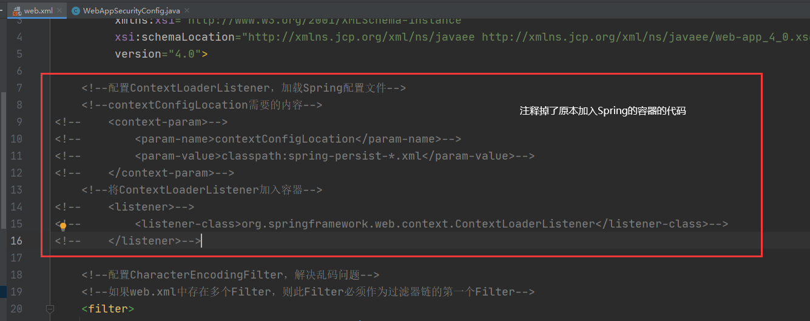

# 在项目中加入SpringSecurity

目标：在原本的项目中使用SpringSecurity，替换原本自己写的登录、访问等机制。

## 一、加入SpringSecurity环境

### 1）、加入依赖

在父工程的pom文件规定SpringSecurity的版本信息：

```xml
<!-- SpringSecurity 依赖配置 -->
<!-- ${fall.spring.security.version}：就是4.2.10.RELEASE版本 -->

<!-- SpringSecurity 对 Web 应用进行权限管理 -->
<dependency>
    <groupId>org.springframework.security</groupId>
    <artifactId>spring-security-web</artifactId>
    <version>${fall.spring.security.version}</version>
</dependency>
<!-- SpringSecurity 配置 -->
<dependency>
    <groupId>org.springframework.security</groupId>
    <artifactId>spring-security-config</artifactId>
    <version>${fall.spring.security.version}</version>
</dependency>
<!-- SpringSecurity 标签库 -->
<dependency>
    <groupId>org.springframework.security</groupId>
    <artifactId>spring-security-taglibs</artifactId>
    <version>${fall.spring.security.version}</version>
</dependency>
```

在component工程中引入依赖：

```xml
<!-- SpringSecurity 对 Web 应用进行权限管理 -->
<dependency>
    <groupId>org.springframework.security</groupId>
    <artifactId>spring-security-web</artifactId>
</dependency>

<!-- SpringSecurity 配置 -->
<dependency>
    <groupId>org.springframework.security</groupId>
    <artifactId>spring-security-config</artifactId>
</dependency>

<!-- SpringSecurity 标签库 -->
<dependency>
    <groupId>org.springframework.security</groupId>
    <artifactId>spring-security-taglibs</artifactId>
</dependency>
```

### 2）、在web.xml中配置

```xml
<!--加入 SpringSecurity 控制权限的 Filter-->
<filter>
    <filter-name>springSecurityFilterChain</filter-name>
    <filter-class>org.springframework.web.filter.DelegatingFilterProxy</filter-class>
</filter>

<filter-mapping>
    <filter-name>springSecurityFilterChain</filter-name>
    <url-pattern>/*</url-pattern>
</filter-mapping>
```

### 3）、创建基于注解的SpringSecurity配置类

```java
@Configuration			// 设置为配置类
@EnableWebSecurity		// 开启web环境下的权限控制功能
// 需要继承WebSecurityConfigurerAdapter
public class WebAppSecurityConfig extends WebSecurityConfigurerAdapter {


}
```

### 注意：

此时启动Tomcat，会==触发找不到springSecurityFilterChain Bean的问题==，这是因为我们创建的WebAppSecurityConfig配置类放在mvc的包下，是交给SpringMVC去扫描的（因为需要让SpringSecurity针对浏览器进行权限控制，就需要让SpringMVC来扫描配置类）。但是DelegatingFilterProxy初始化时，会默认到Spring的容器中寻找springSecurityFilterChain组件，这样是不可能找到的；而在第一次请求时，它依然会去Spring容器中寻找，还是找不到，因此会触发该异常。

解决方案：

​	一、修改源码，让DelegatingFilterProxy先扫描SpringMVC的容器；

​	二、将Spring的IOC容器和SpringMVC的IOC容器在web.xml中合为一个。


这里选用了**第二种方法**（修改源码的方式相对较复杂，并且修改后，在后面实验过程也需要修改源码，方法二则可以比较快捷）



```xml
<!--配置DispatcherServlet（即配置SpringMVC的前端控制器）-->
<servlet>
    <servlet-name>dispatcherServlet</servlet-name>
    <servlet-class>org.springframework.web.servlet.DispatcherServlet</servlet-class>
    <!--指定SpringMVC配置文件-->
    <init-param>
        <param-name>contextConfigLocation</param-name>
        <param-value>classpath:spring-*.xml</param-value>
    </init-param>

    <!--使DispatcherServlet在Web应用启动时就创建对象并初始化-->
    <load-on-startup>1</load-on-startup>
</servlet>
```


此时该异常就可以解决了


## 二、在项目中使用SpringSecurity


### 1）、放行登录页与静态资源

这里需要**重写WebSecurityConfigurerAdapter的configure(HttpSecurity security)方法**。

```java
@Configuration
@EnableWebSecurity
public class WebAppSecurityConfig extends WebSecurityConfigurerAdapter {
    
    @Override
    protected void configure(HttpSecurity security) throws Exception {
        // String数组，列出需要放行的资源的路径
        String[] permitUrls = {"/index.jsp","/bootstrap/**",
                "/crowd/**","/css/**","/fonts/**","/img/**",
                "/jquery/**","/layer/**","/script/**","/ztree/**","/admin/login/page.html"};
        security
                .authorizeRequests()        // 表示对请求进行授权
                .antMatchers(permitUrls)    // 传入的ant风格的url
                .permitAll()                // 允许上面的所有请求，不需要认证

                .anyRequest()               // 设置其他未设置的全部请求
                .authenticated()            // 表示需要认证
                ;
    }
}
```


### 2）、进行登录认证

依旧是通过configure(HttpSecurity security)方法，在上面的代码的security设置的基础上再加入下面的代码：

```java
@Override
protected void configure(HttpSecurity security) throws Exception {
	security.
        .csrf()         // 设置csrf
        .disable()      // 关闭csrf

        .formLogin()                                    // 开启表单登录功能
        .loginPage("/admin/login/page.html")            // 指定登陆页面
        .usernameParameter("login-user")                // 设置表单中对应用户名的标签的name属性名
        .passwordParameter("login-pwd")                 // 设置表单中对应密码的标签的name属性名
        .loginProcessingUrl("/security/do/login.html")  // 设置登录请求的提交地址
        .defaultSuccessUrl("/admin/main/page.html")     // 设置登陆成功后前往的地址
        .and()
        .logout()                                       // 开启退出登录功能
        .logoutUrl("/security/do/logout.html")          // 设置退出登录的url
        .logoutSuccessUrl("/admin/login/page.html")    // 设置退出成功后前往的页面
}
```

这里开启了登录与退出功能后，要修改原先的登录按钮、退出按钮的触发的url，以达到通过SpringSecurity进行登录退出的目的。

关闭csrf是因为这里开发环境为了方便（否则所有提交都需要是post方式，且需要再隐藏域中带csrf的信息，在开发时就比较麻烦）


①修改**admin-login.jsp**的代码:

主要是修改了表单的action、输入框的账号密码的name要与前面的usernameParameter、passwordParameter中的参数相同。

​	通过**${SPRING_SECURITY_LAST_EXCEPTION.message}**可以在前端显示由Spring Security抛出的异常信息

```jsp
<form action="security/do/login.html" method="post" class="form-signin" role="form">
    <h2 class="form-signin-heading"><i class="glyphicon glyphicon-log-in"></i> 用户登录</h2>
    <p>${requestScope.exception.message}</p>
    <p>${SPRING_SECURITY_LAST_EXCEPTION.message}</p>
    <div class="form-group has-success has-feedback">
        <input type="text" name="login-user" class="form-control" id="inputSuccess4" placeholder="请输入登录账号" autofocus>
        <span class="glyphicon glyphicon-user form-control-feedback"></span>
    </div>
    <div class="form-group has-success has-feedback">
        <input type="text" name="login-pwd" class="form-control" id="inputSuccess4" placeholder="请输入登录密码" style="margin-top:10px;">
        <span class="glyphicon glyphicon-lock form-control-feedback"></span>
    </div>
    <div class="checkbox" style="text-align:right;"><a href="reg.html">我要注册</a></div>
    <button type="submit" class="btn btn-lg btn-success btn-block">登录</button>
</form>
```

②修改登录后的页面中退出按钮的代码**include-nav.jsp**：

```jsp
<ul class="dropdown-menu" role="menu">
    <li><a href="#"><i class="glyphicon glyphicon-cog"></i> 个人设置</a></li>
    <li><a href="#"><i class="glyphicon glyphicon-comment"></i> 消息</a></li>
    <li class="divider"></li>
    <li><a href="security/do/logout.html"><i class="glyphicon glyphicon-off"></i> 退出系统</a></li>
</ul>
```


此处先演示通过内存的登录认证：

需要重写WebSecurityConfigurerAdapter的configure(AuthenticationManagerBuilder builder)方法。

```java
@Configuration
@EnableWebSecurity
public class WebAppSecurityConfig extends WebSecurityConfigurerAdapter {
    @Override
    protected void configure(AuthenticationManagerBuilder builder) throws Exception {
        builder
                .inMemoryAuthentication()        // 开启在内存中进行身份验证（开发时暂用）
                .withUser("tom")        		 // 设置用户名
                .password("123456")              // 设置密码
                .roles("ADMIN");                 // 设置权限
    }
}
```


测试可用后，替换为通过数据库进行用户登录的认证

前提条件：

1. 可以通过前端传入的用户名从数据库得到Admin对象
2. 可以通过AdminId得到admin对应角色的List
3. 可以通过AdminId得到权限的name的List

满足这些条件后，通过实现UserDetailsService接口，通过其**loadUserByUsername(String username)**方法，传入username，返回最后的结果，也就是所有验则操作交给该实现类来处理。

条件1：

在AdminServiceImpl中添加getAdminByLoginAcct方法（其接口也需要添加该方法）：

```java
@Override
public Admin getAdminByLoginAcct(String loginAcct) {	// 通过loginAcct得到Admin对象
    AdminExample example = new AdminExample();
    AdminExample.Criteria criteria = example.createCriteria();
    criteria.andLoginAcctEqualTo(loginAcct);
    List<Admin> admins = adminMapper.selectByExample(example);
    Admin admin = admins.get(0);
    return admin;
}
```

条件2：

RoleServiceImpl：此处可以使用前面写好的Service方法，通过adminId得到已经分配的角色的List

```java
@Override
public List<Role> queryAssignedRoleList(Integer adminId) {
    return roleMapper.queryAssignedRoleList(adminId);
}
```

条件3：

AuthServiceImpl：

```java
@Override
public List<String> getAuthNameByAdminId(Integer adminId) {
    return authMapper.selectAuthNameByAdminId(adminId);
}
```

AuthMapper.xml：（记得给Mapper接口添加selectAuthNameByAdminId抽象方法，这里省略了）

通过左外连接查询符合要求的权限名字：

```xml
<!-- 通过admin的id得到auth的name -->
<select id="selectAuthNameByAdminId" resultType="string">
  SELECT
  DISTINCT t_auth.name
  from t_auth
  LEFT JOIN inner_role_auth ON inner_role_auth.auth_id = t_auth.id
  LEFT JOIN inner_admin_role ON inner_admin_role.role_id = inner_role_auth.role_id
  WHERE inner_admin_role.admin_id = #{adminId}
  AND t_auth.name != "" and t_auth.name IS NOT NULL
</select>
```


此外，为了方便之后在前端获得Admin更多的信息，创建一个SecurityAdmin类，继承User类，使其在loadUserByUsername方法中返回时，内容更多：

```java
/**
 * 为了能方便地获取到原始地Admin对象，因此创建一个SecurityAdmin类，继承User。
 */
public class SecurityAdmin extends User {

    private Admin originalAdmin;

    public SecurityAdmin(Admin admin, List<GrantedAuthority> authorities){
        
        // 调用父类的构造方法
        super(admin.getUserName(),admin.getUserPswd(),authorities);
		
        // 将Admin对象放入对象
        this.originalAdmin = admin;

    }

    public Admin getOriginalAdmin(){
        return this.originalAdmin;
    }
}
```


最后编写UserDetailsService的实现类CrowdUserDetailsService：

```java
@Component		// 也需要扫描入SpringMVC容器，用于自动注入
public class CrowdUserDetailsService implements UserDetailsService {

    @Autowired
    private AdminService adminService;

    @Autowired
    private RoleService roleService;

    @Autowired
    private AuthService authService;

    @Override
    public UserDetails loadUserByUsername(String username) throws UsernameNotFoundException {
        // 通过用户名得到Admin对象
        Admin admin = adminService.getAdminByLoginAcct(username);

        // 通过AdminId得到角色List
        List<Role> roles = roleService.queryAssignedRoleList(admin.getId());

        // 通过AdminId得到权限name地List
        List<String> authNameList = authService.getAuthNameByAdminId(admin.getId());

        // 创建List用来存放GrantedAuthority（权限信息）
        List<GrantedAuthority> authorities = new ArrayList<>();

        // 向List存放角色信息，注意角色必须要手动加上 “ROLE_” 前缀
        for (Role role : roles){
            String roleName = "ROLE_" + role.getName();
            SimpleGrantedAuthority simpleGrantedAuthority = new SimpleGrantedAuthority(roleName);
            authorities.add(simpleGrantedAuthority);
        }

        // 向List存放权限信息
        for (String authName : authNameList){
            SimpleGrantedAuthority simpleGrantedAuthority = new SimpleGrantedAuthority(authName);
            authorities.add(simpleGrantedAuthority);
        }

        // 将Admin对象、权限信息封装入SecurityAdmin对象（User的子类）
        SecurityAdmin securityAdmin = new SecurityAdmin(admin,authorities);

        // 返回SecurityAdmin对象
        return securityAdmin;
    }
}
```

注意：如果使存入的是角色，这种方式的存入必须要手动加入**”ROLE_“**前缀。


最后在配置类中使用CrowdUserDetailsService：

```java
@Configuration
@EnableWebSecurity
public class WebAppSecurityConfig extends WebSecurityConfigurerAdapter {

    @Autowired
    UserDetailsService userDetailsService;

    @Override
    protected void configure(AuthenticationManagerBuilder builder) throws Exception {
        builder
                .userDetailsService(userDetailsService);
    }
}
```


### 3）、密码加密与擦除

#### ①密码加密

通过BCryptPasswordEncoder，进行加密

首先将BCryptPasswordEncoder加入IOC容器：

（因为现在只有一个IOC容器了，因此放在哪个Spring配置文件中都可以，这里是放在spring-persist-tx.xml中）

```xml
<!-- 将BCryptPasswordEncoder装配入IOC容器 -->
<bean class="org.springframework.security.crypto.bcrypt.BCryptPasswordEncoder" id="passwordEncoder"/>
```

之后在配置类中使用加密：

```java
@Configuration
@EnableWebSecurity
public class WebAppSecurityConfig extends WebSecurityConfigurerAdapter {

    @Autowired
    UserDetailsService userDetailsService;

    @Autowired
    BCryptPasswordEncoder passwordEncoder;

    @Override
    protected void configure(AuthenticationManagerBuilder builder) throws Exception {
        builder
                .userDetailsService(userDetailsService)
                .passwordEncoder(passwordEncoder);      // 使用BCryptPasswordEncoder进行带盐值的密码加密
    }
}
```


#### ②密码擦除

对于User对象中自带的密码属性，SpringSecurity已经擦除了，我们只需要删除SecurityAdmin对象中Admin对象的密码即可：

**修改SecurityAdmin的构造方法**，最后添加一个**设置userPswd=null**即可

```java
public SecurityAdmin(Admin admin, List<GrantedAuthority> authorities){
    super(admin.getUserName(),admin.getUserPswd(),authorities);

    this.originalAdmin = admin;
    // 为了保证安全性，擦除放入originalAdmin的对象的密码
    this.originalAdmin.setUserPswd(null);
}
```


### 4）、前端显示登录用户昵称

修改include-nav.jsp的代码：

①引入Spring Security的标签库

`<%@taglib prefix="security" uri="http://www.springframework.org/security/tags" %>`

②使用security标签显示昵称

`<security:authentication property="principal.originalAdmin.userName"/>`

```jsp
<%--引入security标签库--%>
<%@taglib prefix="security" uri="http://www.springframework.org/security/tags" %>
<nav class="navbar navbar-inverse navbar-fixed-top" role="navigation">
    <div class="container-fluid">
        <div class="navbar-header">
            <div><a class="navbar-brand" style="font-size:32px;" href="#">众筹平台 - 控制面板</a></div>
        </div>
        <div id="navbar" class="navbar-collapse collapse">
            <ul class="nav navbar-nav navbar-right">
                <li style="padding-top:8px;">
                    <div class="btn-group">
                        <button type="button" class="btn btn-default btn-success dropdown-toggle" data-toggle="dropdown">
                            <i class="glyphicon glyphicon-user">
                          <%--通过principal.originalAdmin.userName得到当前用户的昵称（principal其实就是前面返回的SecurityAdmin对象）--%>
                                <security:authentication property="principal.originalAdmin.userName"/>
                            </i>
                            <span class="caret"></span>
                        </button>
```

property中，principal其实就代表了loadUserByUsername返回的SecurityAdmin对象，因此可以从中取出originalAdmin，得到username。

**这也是为什么，需要擦除密码，如果不擦除，那么可以直接从前端获得密码，这样并不安全。**


### 5）、权限控制

假设这样一些数据：
	用户：adminOperator
		角色：经理
			权限：无
		角色：经理操作者
			权限：user:save
	最终组装后：ROLE_经理，ROLE\_经理操作者，user:save

​	用户：roleOperator
​		角色：部长
​			权限：无
​		角色：部长操作者
​			权限：role:delete
​	最终组装后：ROLE\_部长，ROLE_部长操作者，role:delete


①设置只有拥有经理角色时，可以访问用户的分页显示页面，只有拥有部长角色时，可以访问角色分页页面

先在前端写好的页面中设置好对应上面的用户的各项数据（角色、权限等）

设置页面的权限：

方法一：通过configure(HttpSecurity security)方法，用HttpSecurity设置：

```java
    @Override
    protected void configure(HttpSecurity security) throws Exception {
        security
            .authorizeRequests()        // 表示对请求进行授权
            .antMatchers(permitUrls)    // 传入的ant风格的url
            .permitAll()                // 允许上面的所有请求，不需要认证
            
            .antMatchers("/admin/page/page.html")	// 设置要得到admin的分页信息
            .hasRole("经理");						   // 必须具有经理的角色
    }
```

也可以不用hasRole这类，而是使用**access()方法**

```java
@Override
protected void configure(HttpSecurity security) throws Exception {
    security
            .authorizeRequests()        // 表示对请求进行授权
            .antMatchers(permitUrls)    // 传入的ant风格的url
            .permitAll()                // 允许上面的所有请求，不需要认证

            .antMatchers("/admin/page/page.html")   // 设置要得到admin的分页信息
            .access("hasRole('经理') or hasAuthority('user:get')") // 必须具有经理的角色或有user:get的权限
}
```


方法二：在对应的Handler方法上加**@PreAuthorize()注解**：

```java
// 以json形式显示分页后的role信息
@PreAuthorize("hasRole('部长')")
@ResponseBody
@RequestMapping("/role/page/page.json")
public ResultEntity<PageInfo<Role>> getPageInfo(
        @RequestParam(value = "pageNum", defaultValue = "1") Integer pageNum,
        @RequestParam(value = "pageSize", defaultValue = "5") Integer pageSize,
        @RequestParam(value = "keyword", defaultValue = "") String keyword ) {
    // 从Service层得到pageInfo
    PageInfo<Role> pageInfo = roleService.getPageInfo(pageNum, pageSize, keyword);

    // 返回ResultEntity，Data就是得到的pageInfo
    return ResultEntity.successWithData(pageInfo);
}
```

==注意：通过加注解的方法设置，则必须在配置类上加**@EnableGlobalMethodSecurity(prePostEnabled = true)**注解==


**hasAuthority()中放权限信息，hasRole()中放角色信息。**

而通过access方法，可以让拥有经理角色，或有user:get权限的用户访问用户分页页面。

此时如果在添加用户的handler方法上加注解，设置只有有user:save权限的用户可以进行新增操作：

```java
@PreAuthorize("hasAuthority('user:save')")
@RequestMapping("/admin/page/doSave.html")
public String addAdmin(Admin admin){
    // 调用service层存储admin对象的方法
    adminService.saveAdmin(admin);

    // 重定向会原本的页面，且为了能在添加管理员后看到管理员，设置pageNum为整型的最大值（通过修正到最后一页）
    return "redirect:/admin/page/page.html?pageNum="+Integer.MAX_VALUE;
}
```

则roleOperator只能访问分页页面，但是不能进行用户增加操作，而adminOperator可以进行用户增加操作。


**给SpringSecurity的权限控制添加异常映射的机制**

通过exceptionHandling()方法，以及accessDeniedHandler()传入一个AccessDeniedHandler的匿名实现类：

**注意：这种方法，只对security中配置的角色、权限控制有效，在方法上加注解的方式的权限控制，异常会交给前面我们自己编写的异常控制类，因为方法上加注解，抛出异常会被异常控制类捕捉到，但是在configure方法中设置角色、权限信息，则无法被异常控制类捕捉到，需要借助exceptionHandling。**

```java
@Override
protected void configure(HttpSecurity security) throws Exception {
    security
        .exceptionHandling()
        .accessDeniedHandler(new AccessDeniedHandler() {
            @Override
            public void handle(HttpServletRequest request, HttpServletResponse response, AccessDeniedException e) 
                throws IOException, ServletException {
                request.setAttribute("exception", new Exception("抱歉，您没有权限访问该资源！"));
                request.getRequestDispatcher("/WEB-INF/system-error.jsp").forward(request,response);
            }
        });
}
```


#### 页面元素的权限控制

可以对页面上的局部元素进行访问权限的控制：

需要在JSP页面中引入SpringSecurity的标签库

`<%@taglib prefix="security" uri="http://www.springframework.org/security/tags" %>`

控制如下：

通过**security:authorize**标签，access与前面的方法一样，在里面写表达式，满足角色、权限的条件则会显示给用户，如果不满足，就不会显示。

```jsp
<div class="col-sm-9 col-sm-offset-3 col-md-10 col-md-offset-2 main">
    <h1 class="page-header">控制面板</h1>
    <div class="row placeholders">
        
        <security:authorize access="hasRole('经理')">
            <div class="col-xs-6 col-sm-3 placeholder">
                
                <h4>Label</h4>
                <span class="text-muted">Something else</span>
            </div>
        </security:authorize>
        <security:authorize access="hasAuthority('role:delete')">
            <div class="col-xs-6 col-sm-3 placeholder">
                
                <h4>Label</h4>
                <span class="text-muted">Something else</span>
            </div>
        </security:authorize>
        
		... ...
    </div>
</div>
```