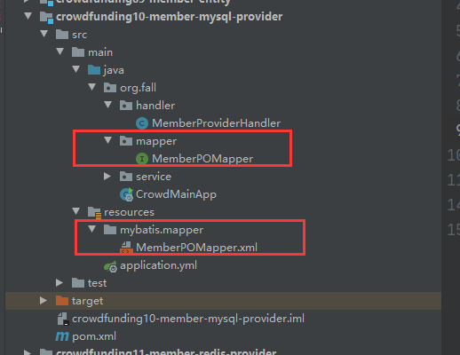

# 前台会员系统架构


## 架构图


## 需要创建的工程

​    父工程：crowdfunding07-member-parent
​    注册中心：crowdfunding08-member-eureka
​    实体类模块：crowdfunding09-member-entity
​    MySQL数据服务：crowdfunding10-member-mysql-provider
​    Redis数据服务：crowdfunding11-member-redis-provider
​    会员中心：crowdfunding12-member-authentication-consumer
​    项目维护：crowdfunding13-member-project-consumer
​    订单维护：crowdfunding14-member-order-consumer
​    支付功能：crowdfunding15-member-pay-consumer
​    网关：crowdfunding16-member-zuul
​    API模块：crowdfunding17-member-api

父工程下面的工程都是父工程的子工程

## parent工程约定版本号

```xml
<!-- 在parent工程进行依赖管理 -->
<dependencyManagement>
    <dependencies>
        <!-- 导入SpringCloud需要的依赖信息 -->
        <dependency>
            <groupId>org.springframework.cloud</groupId>
            <artifactId>spring-cloud-dependencies</artifactId>
            <version>Hoxton.SR8</version>
            <type>pom</type>
            <scope>import</scope>
        </dependency>
        <!-- SpringBoot依赖信息 -->
        <dependency>
            <groupId>org.springframework.boot</groupId>
            <artifactId>spring-boot-dependencies</artifactId>
            <version>2.3.3.RELEASE</version>
            <type>pom</type>
            <scope>import</scope>
        </dependency>

        <!--SpringBoot整合MyBatis的依赖-->
        <dependency>
            <groupId>org.mybatis.spring.boot</groupId>
            <artifactId>mybatis-spring-boot-starter</artifactId>
            <version>2.1.3</version>
        </dependency>

        <!--druid依赖信息-->
        <dependency>
            <groupId>com.alibaba</groupId>
            <artifactId>druid</artifactId>
            <version>1.1.17</version>
        </dependency>

    </dependencies>
</dependencyManagement>
```


## 搭建环境约定

包名：

​	所有新建的包都作为org.fall的子包

主启动类类名：

​	CrowdMainApp

端口号：

        注册中心：crowdfunding08-member-eureka                  1000
        MySQL数据服务：crowdfunding10-member-mysql-provider     2000
        Redis数据服务：crowdfunding11-member-redis-provider     3000
        会员中心：crowdfunding12-member-authentication-consumer 4000
        项目维护：crowdfunding13-member-project-consumer        5000
        订单维护：crowdfunding14-member-order-consumer          7000
        支付功能：crowdfunding15-member-pay-consumer            8000
        网关：crowdfunding16-member-zuul                        80


# 分布式的各个工程

## 1、Eureka

依赖：

```xml
<dependencies>
    <dependency>
        <groupId>org.springframework.cloud</groupId>
        <artifactId>spring-cloud-starter-netflix-eureka-server</artifactId>
    </dependency>
</dependencies>
```

application.yml：

```yml
server:
  port: 1000
spring:
  application:
    name: crowd-eureka
eureka:
  instance:
    hostname: localhost
  client:
    fetch-registry: false
    register-with-eureka: false
    service-url:
      defaultZone: http://${eureka.instance.hostname}:${server.port}/eureka/
```

主启动类：

```java
@EnableEurekaServer
@SpringBootApplication
public class CrowdMainApp {

    public static void main(String[] args) {
        SpringApplication.run(CrowdMainApp.class, args);
    }
}
```


## 2、Entity

为了使用lombok插件，引入lombok的依赖

```xml
<dependencies>
    <dependency>
        <groupId>org.projectlombok</groupId>
        <artifactId>lombok</artifactId>
        <version>1.16.12</version>
    </dependency>
</dependencies>
```

项目结构：


VO:

​	View Object  视图对象

​		可以用于接收浏览器发来的数据，也可以把数据发送给浏览器显示

PO：

​	Persistent Object  持久化对象

​		与数据库的表对应

## 3、MySQL

依赖

```xml
<dependencies>

    <!-- druid连接池 -->
    <dependency>
        <groupId>com.alibaba</groupId>
        <artifactId>druid</artifactId>
    </dependency>

    <!-- MyBatis依赖 -->
    <dependency>
        <groupId>org.mybatis.spring.boot</groupId>
        <artifactId>mybatis-spring-boot-starter</artifactId>
    </dependency>

    <!-- mysql驱动 -->
    <dependency>
        <groupId>mysql</groupId>
        <artifactId>mysql-connector-java</artifactId>
    </dependency>

    <!-- eureka客户端依赖 -->
    <dependency>
        <groupId>org.springframework.cloud</groupId>
        <artifactId>spring-cloud-starter-netflix-eureka-client</artifactId>
    </dependency>

    <!-- web环境（为了能对外暴露接口） -->
    <dependency>
        <groupId>org.springframework.boot</groupId>
        <artifactId>spring-boot-starter-web</artifactId>
    </dependency>

    <!-- 测试 -->
    <dependency>
        <groupId>org.springframework.boot</groupId>
        <artifactId>spring-boot-starter-test</artifactId>
        <scope>test</scope>
        <exclusions>
            <exclusion>
                <groupId>org.junit.vintage</groupId>
                <artifactId>junit-vintage-engine</artifactId>
            </exclusion>
        </exclusions>
    </dependency>

    <!-- 实体类依赖 -->
    <dependency>
        <groupId>org.fall</groupId>
        <artifactId>crowdfunding09-member-entity</artifactId>
        <version>1.0-SNAPSHOT</version>
    </dependency>

    <!-- 工具类依赖 -->
    <dependency>
        <groupId>org.example</groupId>
        <artifactId>crowdfunding05-common-util</artifactId>
        <version>1.0-SNAPSHOT</version>
    </dependency>

</dependencies>
```

建数据库表

```sql
CREATE TABLE t_member (
	id INT ( 11 ) NOT NULL auto_increment,
	login_acct VARCHAR ( 255 ) NOT NULL,
	user_pswd CHAR ( 200 ) NOT NULL,
	user_name VARCHAR ( 255 ),
	email VARCHAR ( 255 ),
	authstaus INT ( 4 ) COMMENT '实名认证状态 0- 未实名认证, 1- 实名认证申请中, 2- 已实名认证',
	user_type INT ( 4 ) COMMENT '0- 个人 , 1- 企业',
	real_name VARCHAR ( 255 ),
	card_num VARCHAR ( 255 ),
	acct_type INT ( 4 ) COMMENT '0- 企业, 1- 个体, 2- 个人, 3- 政府',
	PRIMARY KEY ( id ) 
)
```

使用前面后台系统的逆向工程，逆向生成java代码：

这里设置实体类的名字为MemberPO（就是加上PO）

```xml
<!-- 数据库表名与需要的实体类对应映射的指定 -->
<table tableName="t_member" domainObjectName="MemberPO"/>
```

**生成后注意修改接口等的包路径的信息，因为之前后台使用的包规则和前台的有区别。**

之后把生成的文件放入对应的路径




给主启动类加上**@MapperScan**注解用于扫描Mapper接口

```java
@MapperScan("org.fall.mapper")
@SpringBootApplication
public class CrowdMainApp {

    public static void main(String[] args) {
        SpringApplication.run(CrowdMainApp.class, args);
    }
}
```

配置application.yml

```yml
server:
  port: 2000
spring:
  application:
    name: crowd-mysql
  datasource:
    name: mydb
    type: com.alibaba.druid.pool.DruidDataSource
    url: jdbc:mysql://localhost:3306/project_rowd?serverTimezone=UTC
    username: root
    password: root
    driver-class-name: com.mysql.cj.jdbc.Driver
eureka:
  client:
    service-url:
      defaultZone: http://localhost:1000/eureka/
mybatis:
  mapper-locations: classpath*:/mybatis/mapper/*Mapper.xml
logging:
  level:
    org.fall.mapper: debug
    org.fall.test: debug
```


### MySQL对外暴露服务

进入到crowdfunding17-member-api工程

先添加依赖

```xml
<dependencies>
    <dependency>
        <groupId>org.example</groupId>
        <artifactId>crowdfunding05-common-util</artifactId>
        <version>1.0-SNAPSHOT</version>
    </dependency>
    <dependency>
        <groupId>org.fall</groupId>
        <artifactId>crowdfunding09-member-entity</artifactId>
        <version>1.0-SNAPSHOT</version>
    </dependency>
    <dependency>
        <groupId>org.springframework.cloud</groupId>
        <artifactId>spring-cloud-starter-openfeign</artifactId>
    </dependency>
</dependencies>
```

在org.fall.api包中建一个接口**MySQLRemoteService**

```java
@FeignClient("crowd-mysql")
public interface MySQLRemoteService {

    @RequestMapping("/get/member/by/login/acct/remote")
    ResultEntity<MemberPO> getMemberPOByLoginAcctRemote(@RequestParam("loginacct") String loginacct);
}
```

与MySQL工程中的Handler中的方法对应：

```java
@RestController
public class MemberProviderHandler {

    @Autowired
    MemberService memberService;

    @RequestMapping("/get/member/by/login/acct/remote")
    public ResultEntity<MemberPO> getMemberPOByLoginAcctRemote(@RequestParam("loginacct") String loginacct){
        try {
            MemberPO memberPO = memberService.getMemberPOByLoginAcct(loginacct);
            return ResultEntity.successWithData(memberPO);
        } catch (Exception e){
            e.printStackTrace();
            return ResultEntity.failed(e.getMessage());
        }
    }

}
```


## 4、Redis

依赖

```xml
<dependencies>

    <!-- redis依赖 -->
    <dependency>
        <groupId>org.springframework.boot</groupId>
        <artifactId>spring-boot-starter-data-redis</artifactId>
    </dependency>

    <!-- eureka客户端依赖 -->
    <dependency>
        <groupId>org.springframework.cloud</groupId>
        <artifactId>spring-cloud-starter-netflix-eureka-client</artifactId>
    </dependency>

    <!-- web环境（为了能对外暴露接口） -->
    <dependency>
        <groupId>org.springframework.boot</groupId>
        <artifactId>spring-boot-starter-web</artifactId>
    </dependency>

    <!-- 测试 -->
    <dependency>
        <groupId>org.springframework.boot</groupId>
        <artifactId>spring-boot-starter-test</artifactId>
        <scope>test</scope>
        <exclusions>
            <exclusion>
                <groupId>org.junit.vintage</groupId>
                <artifactId>junit-vintage-engine</artifactId>
            </exclusion>
        </exclusions>
    </dependency>

    <!-- 实体类依赖 -->
    <dependency>
        <groupId>org.fall</groupId>
        <artifactId>crowdfunding09-member-entity</artifactId>
        <version>1.0-SNAPSHOT</version>
    </dependency>

    <!-- 工具类依赖 -->
    <dependency>
        <groupId>org.example</groupId>
        <artifactId>crowdfunding05-common-util</artifactId>
        <version>1.0-SNAPSHOT</version>
    </dependency>
</dependencies>
```

主启动类

```java
@SpringBootApplication
public class CrowdMainApp {
    public static void main(String[] args) {
        SpringApplication.run(CrowdMainApp.class, args);
    }
}
```

application.yml

```yml
server:
  port: 3000

eureka:
  client:
    service-url:
      defaultZone: http://localhost:1000/eureka/
spring:
  application:
    name: crowd-redis
  redis:
    host: 192.168.0.102
```

### Redis对外暴露服务

先编写自己的handler方法：

```java
@RestController
public class RedisProviderHandler {

	// 自动注入StringRedisTemplate
    @Autowired
    private StringRedisTemplate redisTemplate;

    @RequestMapping("/set/redis/key/value/remote")
    ResultEntity<String> setRedisKeyValueRemote(
            @RequestParam("key") String key,
            @RequestParam("value") String value
    ){

        try {
            ValueOperations<String, String> operations = redisTemplate.opsForValue();
            operations.set(key,value);
            return ResultEntity.successWithoutData();
        }catch (Exception e){
            e.printStackTrace();
            return ResultEntity.failed(e.getMessage());
        }

    }

    @RequestMapping("/set/redis/key/value/with/timeout/remote")
    ResultEntity<String> setRedisKeyValueWithTimeoutRemote(
            @RequestParam("key") String key,
            @RequestParam("value") String value,
            @RequestParam("time") long time,
            @RequestParam("timeUnit") TimeUnit timeUnit
    ){
        try {
            ValueOperations<String, String> operations = redisTemplate.opsForValue();
            operations.set(key,value,time,timeUnit);
            return ResultEntity.successWithoutData();
        }catch (Exception e){
            e.printStackTrace();
            return ResultEntity.failed(e.getMessage());
        }

    }


    @RequestMapping("/get/redis/value/by/key/remote")
    ResultEntity<String> getRedisValueByKeyRemote(
            @RequestParam("key") String key
    ){

        try {
            ValueOperations<String, String> operations = redisTemplate.opsForValue();
            String value = operations.get(key);
            return ResultEntity.successWithData(value);
        }catch (Exception e){
            e.printStackTrace();
            return ResultEntity.failed(e.getMessage());
        }


    }


    @RequestMapping("/remove/redis/key/by/key/remote")
    ResultEntity<String> RemoveRedisKeyByKeyRemote(
            @RequestParam("key") String key
    ){
        try {
            redisTemplate.delete(key);
            return ResultEntity.successWithoutData();
        }catch (Exception e){
            e.printStackTrace();
            return ResultEntity.failed(e.getMessage());
        }

    }


}
```

crowdfunding17-member-api接口

```java
@FeignClient("crowd-redis")
public interface RedisRemoteService {

    @RequestMapping("/set/redis/key/value/remote")
    ResultEntity<String> setRedisKeyValueRemote(
            @RequestParam("key") String key,
            @RequestParam("value") String value
    );

    @RequestMapping("/set/redis/key/value/with/timeout/remote")
    ResultEntity<String> setRedisKeyValueWithTimeoutRemote(
            @RequestParam("key") String key,
            @RequestParam("value") String value,
            @RequestParam("time") long time,
            @RequestParam("timeUnit") TimeUnit timeUnit
            );

    @RequestMapping("/get/redis/value/by/key/remote")
    ResultEntity<String> getRedisValueByKeyRemote(
            @RequestParam("key") String key
    );

    @RequestMapping("/remove/redis/key/by/key/remote")
    ResultEntity<String> RemoveRedisKeyByKeyRemote(
            @RequestParam("key") String key
    );

}
```


## 5、认证页面工程

依赖

```xml
<dependencies>
    <dependency>
        <groupId>org.fall</groupId>
        <artifactId>crowdfunding17-member-api</artifactId>
        <version>1.0-SNAPSHOT</version>
    </dependency>
    <dependency>
        <groupId>org.springframework.cloud</groupId>
        <artifactId>spring-cloud-starter-netflix-eureka-client</artifactId>
    </dependency>
    <dependency>
        <groupId>org.springframework.boot</groupId>
        <artifactId>spring-boot-starter-web</artifactId>
    </dependency>
    <dependency>
        <groupId>org.springframework.boot</groupId>
        <artifactId>spring-boot-starter-thymeleaf</artifactId>
    </dependency>
</dependencies>
```

主启动类

```java
// 开启feign客户端功能
@EnableFeignClients
@SpringBootApplication
public class CrowdMainApp {
    public static void main(String[] args) {
        SpringApplication.run(CrowdMainApp.class, args);
    }
}
```

application.yml

```yml
server:
  port: 4000
spring:
  application:
    name: crowd-auth
  thymeleaf:
    prefix: classpath:/templates/
    suffix: .html
eureka:
  client:
    service-url:
      defaultZone: http://localhost:1000/eureka/
```

加入首页页面作为测试用：


目录结构：


在PortalHandler类中添加映射：

```java
@Controller
public class PortalHandler {

    // 首页，直接访问，而不用加额外的路径
    @RequestMapping("/")
    public String showPortalPage(){
        return "portal";
    }

}
```


## 6、Zuul网关

依赖

```xml
<dependencies>
    <dependency>
        <groupId>org.springframework.cloud</groupId>
        <artifactId>spring-cloud-starter-netflix-eureka-client</artifactId>
    </dependency>
    <dependency>
        <groupId>org.springframework.cloud</groupId>
        <artifactId>spring-cloud-starter-netflix-zuul</artifactId>
    </dependency>
</dependencies>
```

主配置类：

```java
// 开启Zuul
@EnableZuulProxy
@SpringBootApplication
public class CrowdMainApp {

    public static void main(String[] args) {
        SpringApplication.run(CrowdMainApp.class,args);
    }

}
```

application.yml

```yml
server:
  port: 80			# 80端口可以直接通过域名/ip访问，不用额外加端口号
spring:
  application:
    name: crowd-zuul
eureka:
  client:
    service-url:
      defaultZone: http://localhost:1000/eureka/
zuul:
  ignored-services: "*"       # 表示忽视直接通过application-name访问微服务，必须通过route
  sensitive-headers: "*"      # 在Zuul向其他微服务重定向时，保持原本的头信息（请求头、响应头）
  routes:                     # 指定网关路由
    crowd-protal:
      service-id: crowd-auth  # 对应application-name
      path: /**               # 表示直接通过根路径访问，必须加上**，否则多层路径无法访问
```


到这里，基础的环境就搭建完成了，附上搭建完成的项目目录结构图：

